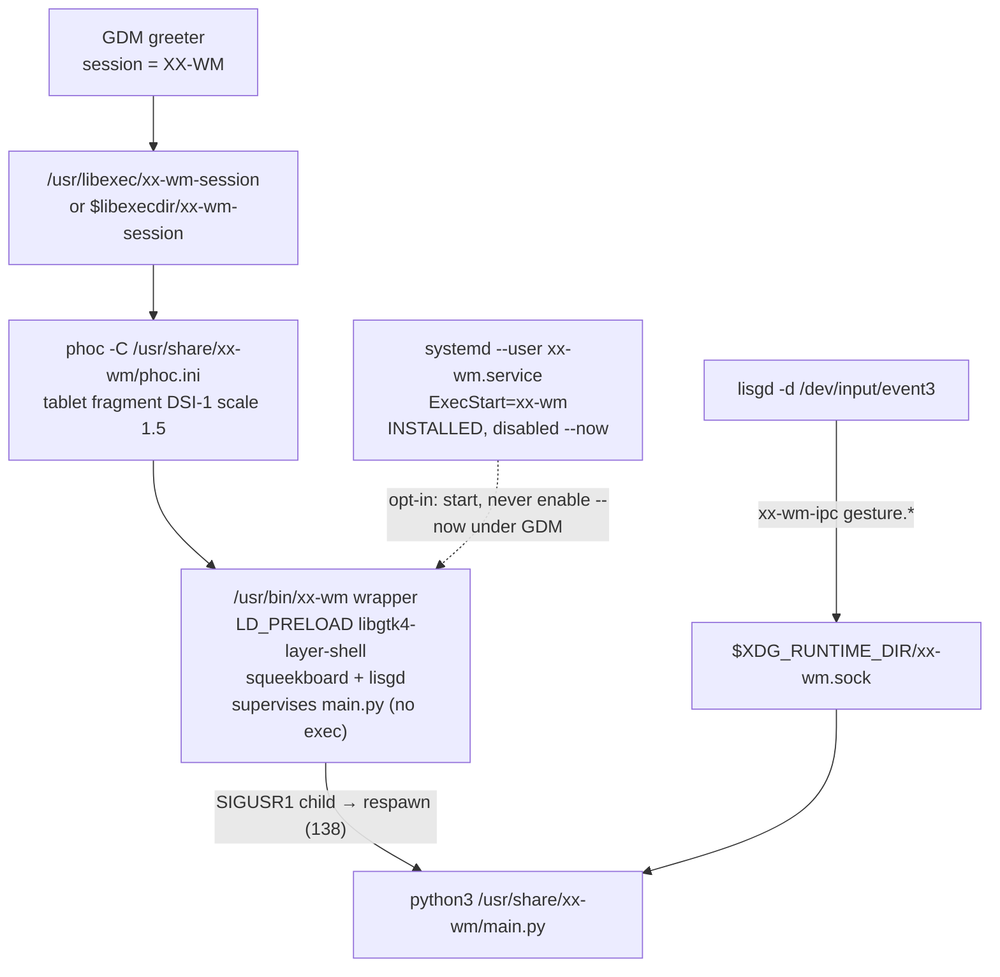
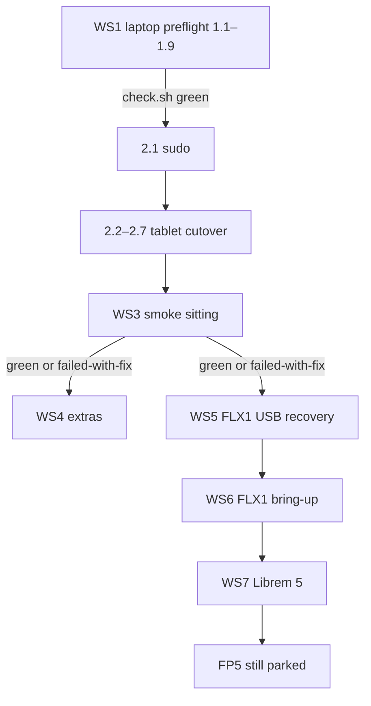

# XX-WM Build / Implementation Spec — Bootable meson install, tablet cutover, then FLX1 / Librem 5

| Field | Value |
|---|---|
| **Title** | XX-WM smoke-ready build spec |
| **Author** | Skippy / PiercingXX |
| **Date** | 2026-09-06 |
| **Status** | WS1 landed on main (`6a0b2c3`); 1b closed; check.sh 663 passed, 3 skipped; next is Workstream 2 |
| **Audience** | Skippy (implementation agent) — build from this document; do not guess |
| **UI contract** | `design.md` wins on every UI disagreement |
| **Work order** | `todo.md` remains the checkbox list. Do **not** restore WS1–28 history. Tick boxes as items land. WS1 verify line is 660 passed, 3 skipped; 1b records a new count. |
| **Repo** | `/media/Working-Storage/GitHub/Phone-Projects/linux/xx-wm` |

This is the engineering plan to make a meson-installed session bootable, cut the x86 tablet over from piercing-shell to XX-WM, smoke it over SSH, then bring up FLX1 and the Librem 5. It is not a product vision doc.

---

## Overview

Workstream 1 landed on main (`6a0b2c3`). A meson install of this tree ships `hud.py` / `lock_lines.py` / `toplevel_manager.py`; `install.sh` speaks pacman; the systemd user unit stays disabled when the wayland-session file exists; lisgd action names map through `ACTION_TO_VERB`; `deploy.sh` writes `/usr/share/xx-wm` and SIGUSR1s the python child; theme hot-reload fans out past the five original surfaces. Do not reopen 1.1–1.9.

The tablet (`dr3k@192.168.1.129`, PiercingXX Arch, 1.8 GiB RAM, GDM → PiercingXX/`piercing-session` → phoc → `piercing-shell`) is still the pre-rename stack, up and SSH-able. Fairphone 5 is parked. Sequence is **tablet cutover → FLX1 → Librem 5**.

This spec tells Skippy exactly which files, symbols, tests, verify commands, and rollback signs belong to each work item. Device cutover is operational, not a code dump. The table below is the hole list WS1 closed — not present-tense truth.

---

## Background & Motivation

### Before WS1 (repo)

Closed on `6a0b2c3`. Kept as the hole list so 1.1–1.9 stay the historical how.

| Piece | Path | Problem (before WS1) |
|---|---|---|
| Meson Python set | `launcher/meson.build` `install_data([...])` | 36 of 39 `launcher/src/*.py` files. Missing `src/hud.py`, `src/lock_lines.py`, `src/toplevel_manager.py`. Runtime crash: `main.py` `_show_shell` → `from hud import Hud`. Next crashes: lock (`lock_lines`) and switcher (`toplevel_manager`). |
| Vendored protocols | `launcher/src/wayland_proto/*.py` | Installed; `scripts/check.sh` py_compile does **not** compile them. |
| Installer | `scripts/install.sh` | `PKG` is apk or apt only. Tablet is Arch. `enable_service` always `systemctl --user enable xx-wm`. Success text says “PiercingOS”. `select_phoc_scale` `|| return 0` keeps meson default `DSI-1` scale 2.5. |
| Gestures | `launcher/src/gesture_bindings.py` `resolve_verb` | Accepts only `IPC_VERBS`. `GestureConfig._DEFAULTS` store action names (`home`, `app_switcher`, …). Defaults fall through to `DEFAULT_VERBS` (`swipe_up_short` → `gesture.keyboard`). |
| Deploy | `scripts/deploy.sh` | Rsyncs to `${TARGET}:~/xx-wm/src/`. Installed shell is `/usr/share/xx-wm/`. Default `XX_WM_USER=user`. |
| Re-theme | `window.ShellWindow._retheme_surfaces` | Walks `_shade`, `_dialer`, `_call_ui`, `_call_bar`, `_power_menu` only. HUD, switcher, lock, back overlay, QA panel, and the **application-owned** hardware `PowerMenu` stay construction-time stale. |
| Gate | `.venv`, CI | Neither exists on the laptop. |

### Live tablet snapshot (2026-09-04, verified over SSH)

| Fact | Value |
|---|---|
| SSH | `dr3k@192.168.1.129`, key auth |
| OS | PiercingXX Arch, kernel 7.1.4-arch1-1, x86_64, systemd, Python 3.14.6 |
| RAM / disk | 1.8 GiB (~875 MiB available), 29 G eMMC, 10 G free |
| Login | GDM enabled. Session **PiercingXX**: `/usr/libexec/piercing-session` → `phoc -C /usr/share/piercing-shell/phoc.ini -E /usr/bin/piercing-shell` |
| Groups | `dr3k` in `input` and `wheel` |
| Sudo | Treat passwordless sudo as **available for Skippy** unless `sudo -n true` fails. User is installing `/etc/sudoers.d/xx-wm-smoke` via `scripts/grant-tablet-sudo.sh` (`NOPASSWD: ALL`). Filename has no `.`. |
| Touch | FTSC1000 `/dev/input/event3`, `INPUT_PROP_DIRECT`. lisgd already bound. **lisgd is source-built at `/usr/bin/lisgd`, not a pacman package.** |
| Panel | DRM `DSI-1` 1200×1920. Installed piercing-shell `phoc.ini` already `scale = 1.5`. XX-WM tablet fragment: `launcher/data/phoc/tablet.ini`. |
| Backlight | `intel_backlight` present. **No IIO illuminance** — Auto-brightness tile must stay hidden (`quick_actions.py` already gates on `ALSBrightness.available()`). |
| Wayland | `WAYLAND_DISPLAY=wayland-0` under `/run/user/1000`. Current IPC: `piercing-shell.sock`. After cutover: `$XDG_RUNTIME_DIR/xx-wm.sock`. |
| Config | `~/.config/piercing-shell/{config.json,gestures.json}`. **No PIN.** `default_layout_applied: true`. Theme `amoled`, font `jetbrains-mono-nerd` (family **not** installed). |
| Custom gestures | `swipe_left_home=launch:htop.desktop`, `swipe_right_home=launch:org.gnome.Nautilus.desktop`. These are **in-shell** home swipes, not lisgd slots. Do not rewrite them. |
| Present | phoc 0.56, gtk4 4.22, libadwaita 1.9, gtk4-layer-shell 1.3, python-gobject, python-pywayland 0.4.18, squeekboard, lisgd, geoclue, NM, PipeWire, gnome-calculator, neovim, whiptail, grim |
| Absent | xx-wm binaries, firefox, waydroid, tailscale, fprintd, wlopm, wlr-randr |
| Repo | **No clone on the tablet.** `~/piercing-dots` exists; its `install.sh` has **no** `--profile phone`. |
| logind | `/etc/systemd/logind.conf.d/10-piercing-power.conf` already ignores power keys. Meson also ships `10-xx-wm-power.conf` — both ignore; coexistence is fine. |

Import the graphical session from SSH:

```sh
export XDG_RUNTIME_DIR=/run/user/1000 WAYLAND_DISPLAY=wayland-0
export DBUS_SESSION_BUS_ADDRESS=unix:path=/run/user/1000/bus
```

### Pain

Before WS1, installing `main` onto this tablet yielded: missing-module crash at first `_show_shell`, GDM double-start if the user unit is enabled, scale 2.5 on a 1200×1920 panel if the device prompt is cancelled, lisgd firing keyboard/home instead of home/switcher, and a deploy loop that cannot update `/usr/share/xx-wm`. Those install-path holes are closed; the remaining pain is that the tablet session is still piercing-shell.

---

## Goals & Non-Goals

### Goals

1. A `meson install --prefix=/usr` tree contains every `launcher/src/*.py` plus `wayland_proto/*.py`, and `python3 /usr/share/xx-wm/main.py` can import `hud`, `lock_lines`, and `toplevel_manager`.
2. `scripts/install.sh` runs on Arch (pacman), **disables** the systemd user unit when the wayland-session file is installed, requires or detects a phoc fragment (tablet = `DSI-1` @ 1.5), and tells the operator to pick **XX-WM**.
3. lisgd system slots honor `gestures.json` action names. User `launch:` home-swipes are untouched.
4. `scripts/deploy.sh` updates `/usr/share/xx-wm/` and the **running** shell (user-unit restart if that unit is active, else SIGUSR1 of the unique `python3 /usr/share/xx-wm/main.py` child; `xx-wm.in` respawns it). Default user `dr3k`. **The supervisor is `/usr/bin/xx-wm` from meson; `deploy.sh` never updates it.** 1.5 has landed; tablet `meson install` may proceed after 2.1/2.2.
5. Theme hot-reload fans out to HUD, switcher, lock, back overlay, QA panel, and both PowerMenu instances.
6. Tablet session cutover: single XX-WM shell, migrated config, no re-seed, no PIN invented.
7. Tablet smoke over SSH + **GLASS** for touch. Then extras (browser, Tailscale, Skippy PWA; piercing-dots when the profile exists). Then FLX1 recovery + bring-up. Then Librem 5.

### Non-goals (parked — do not attempt)

- Fairphone 5 flash / bring-up
- Switcher snapshot thumbnails
- Hyprland / Hyprgrass (tablet may already list a Hyprland session — ignore it)
- Publishing / releases
- Waydroid on the tablet (1.8 GiB RAM / 10 G free)
- Relitigating: XX-WM name/app id/binaries; phoc; lisgd+IPC; squeekboard Colemak; our lock screen; Pixel DnD/Focus; system-only Settings; solid colors; aura; in-shell HUD; `design.md` as UI contract
- Restoring todo.md WS1–28 history
- Renaming the old **PiercingXX** GDM entry from this repo

---

## Ground rules Skippy must follow

Copy these; they are not optional.

- Python 3.12+ (tablet is 3.14.6 — fine), GTK4/libadwaita via `gi`, match existing idiom. No comments unless WHY is non-obvious.
- CSS invariants in `launcher/src/style.css`: uniform theme background; children transparent; no borders except inside `.settings-page`; configured font via `font_theme.apply_global_font`; invisible Paned separators. Surfaces must not hardcode a family.
- Verify before every commit: `sh scripts/check.sh`. Recreate `.venv` with `--system-site-packages` if missing:

  ```sh
  python3 -m venv --system-site-packages .venv
  .venv/bin/pip install pytest ruff
  PATH="$PWD/.venv/bin:$PATH" sh scripts/check.sh
  ```

  Missing shellcheck prints a loud `SKIPPED`; found-but-failing still fails.
- One commit per task or coherent group, imperative subject, body says what changed and how it was verified. Never commit `__pycache__`, `build/`, or `devices/*/downloads/`.
- Config: missing keys → defaults; never crash on old configs. `docs/config.md` updates with every key change. piercing-shell dir migrates by rename once if xx-wm dir absent (`ShellConfig.__init__` in `launcher/src/config.py`).
- Decisions already made (do not relitigate): XX-WM name/app id `io.piercingxx.XXWM` / binaries `xx-wm` `xx-wm-ipc` `xx-wm-session`; phoc; lisgd+IPC; squeekboard Colemak; our lock screen; Pixel DnD/Focus; system-only Settings; solid colors; aura bonus theme; in-shell HUD; `design.md` is the UI contract.
- Minimalism: tablet is underpowered; `preload_gesture_apps` stays off; **no Waydroid on the tablet**.
- If `ssh dr3k@192.168.1.129 sudo -n true` fails, **stop** and tell the user to run `sh scripts/grant-tablet-sudo.sh` from the laptop. Do not store the sudo password in the repo.
- Operator-at-glass steps are marked **GLASS**. Everything else is agent-driven over SSH.
- Do not install on the tablet before Workstream 1.1. Do not touch FLX1 until tablet smoke is green **or** explicitly failed-with-fix.

---

## Key Decisions

| Decision | Rationale |
|---|---|
| Device order: tablet → FLX1 → Librem 5; FP5 parked | User-final. Tablet is the only box SSH-able today. FLX1 is the VoLTE/FP/ALS/Waydroid device. L5 is the performance canary. |
| Preflight on the laptop before any tablet meson install | Installing `main` as-is crashes in `_show_shell`. A wasted sitting. |
| GDM + wayland-session is the session path; systemd user unit is opt-in | `xx-wm.desktop` `Exec=` is `xx-wm-session` → phoc `-E xx-wm`. User unit `ExecStart=` is `xx-wm` (Python shell, no compositor). Enabling both under GDM double-starts the shell. Keep the unit installed for “already inside a compositor”. |
| When the wayland-session file exists, **disable --now** the user unit | Not enabling is not idempotent: a tree that already ran today’s installer still has the unit enabled. `WantedBy=graphical-session.target` would then double-start on the next GDM login. Opt-in is `systemctl --user start` from a session that is **not** already `xx-wm-session` — never `enable --now` under GDM. |
| OpenRC still starts `xx-wm-session`, but the path is meson `@libexecdir@` | `data/openrc/xx-wm` currently hardcodes `/usr/libexec/xx-wm-session`. Arch libexec is often `/usr/lib`. Configure the init script like the systemd unit. |
| Action names in `gestures.json` map to IPC verbs at lisgd generation | Config API documents `home` / `app_switcher` / … . lisgd can only exec `xx-wm-ipc <verb>`. Mapping is the contract; `DEFAULT_VERBS` remain the invalid-value fallback (legacy device behavior). |
| Do not rewrite the user’s `launch:` home-swipe bindings | Those slots are **not** lisgd slots (`swipe_left_home` / `swipe_right_home`). In-shell only. |
| `deploy.sh` rsyncs Python + `style.css` + `wayland_proto/` into `/usr/share/xx-wm/` **without** `--delete` on the datadir | `--delete` against `/usr/share/xx-wm/` would wipe `phoc.ini`, sounds, squeekboard, gnome-osk. Use `sudo rsync -a --chown=root:root` so the datadir stays root-owned (`-a` alone would preserve `dr3k`). |
| GDM path restart = wrapper supervises `main.py`; deploy SIGUSR1s **only** the python child | `phoc -E` must keep `xx-wm` as its client. Gio.Application maps TERM/INT/HUP to quit → `app.run()` returns **0**, which the wrapper must treat as session end. Iterate uses SIGUSR1 (wait 138) or SIGKILL (137), never TERM/INT/HUP. `deploy.sh` rsyncs `/usr/share/xx-wm/` only — it never updates `/usr/bin/xx-wm`. See 1.5. |
| Tablet meson install waits for 1.5 / PR 4 | First GDM XX-WM login runs the **installed** wrapper. If that is still `exec python`, later `deploy.sh` kills phoc’s `-E` client. |
| Default `XX_WM_USER=dr3k` | This tablet. FP5 later is `user` — override per device. |
| phoc fragment: detect `DSI-1` 1200×1920 → `tablet`, else require a selection | Cancel-keeps-default is FP5 scale 2.5 on this panel. `wlr-randr` is **not** installed; probe `/sys/class/drm/card*-DSI-1/modes`. Non-TTY + empty detection → `return 1`, do not spin. |
| Do not enable systemd user unit when `/usr/share/wayland-sessions/xx-wm.desktop` exists | Matches the GDM host. **Disable** it if a previous install enabled it. |
| Success text names **XX-WM**, not PiercingOS | Desktop `Name=XX-WM`. Do not rename the old PiercingXX entry. |
| No Waydroid if `MemTotal` < 3 GiB | Tablet is 1.8 GiB. Gate in `apps.sh`, not a comment. |
| Browser: Waterfox **only if a pacman repo package exists**, else Firefox | Do not pull AUR via yay. x86_64 Waterfox tarball is out of scope for the smoke install. |
| piercing-dots `--profile phone` is consumed, not invented here | `bootstrap-dots.sh` stays a loud stub until that flag exists **upstream**. If `~/piercing-dots` exists, use it and **never** `rm -rf` it; `rm -rf` is only for `~/.cache/piercing-dots`. Land that before 2.3. |
| NOPASSWD ALL is smoke-time | `/etc/sudoers.d/xx-wm-smoke` (no `.` in the filename), `visudo -c`, revoke with `--revoke` after smoke. |
| Never log PINs; never put WiFi PSK on argv | Existing `system_settings` passwd-file path must not regress. |
| `todo.md` stays the checkbox work order | This spec is the how. Tick boxes; record pytest count after 1.9. |

---

## Proposed Design

### Architecture after cutover (tablet)



**Wrong path (must not happen on this tablet):** GDM starts `xx-wm-session` **and** `graphical-session.target` starts `xx-wm.service` → two Python shells, two IPC binds, racing lisgd. `enable --now` from inside the GDM XX-WM session is that wrong path.

### Sequence

```mermaid
sequenceDiagram
  participant Lap as Laptop
  participant Tab as Tablet SSH
  participant Glass as GLASS
  Lap->>Lap: WS1 preflight (1.1–1.9)
  Note over Lap: Do not meson-install on tablet before 1.1
  Lap->>Tab: 2.1 sudo -n true (or stop)
  Lap->>Tab: 2.2 rsync tree to ~/xx-wm
  Lap->>Tab: 2.3 meson install + tablet.ini
  Lap->>Tab: 2.4 GDM OSK overwrite
  Lap->>Glass: 2.5 pick XX-WM (or AccountsService + reboot)
  Tab->>Tab: 2.6 ShellConfig migrates piercing-shell
  Lap->>Tab: 2.7 single-shell verify
  Lap->>Tab: WS3 smoke (grim, ipc, logs)
  Glass->>Tab: touch gestures, lock, folders
  Note over Lap,Tab: WS4 extras; no Waydroid
  Note over Lap: WS5–6 FLX1 only after tablet smoke
  Note over Lap: WS7 Librem 5 last
```

---

## Workstream 1 — Preflight on the laptop

**Landed** on main (`6a0b2c3`). check.sh: 660 passed, 3 skipped. Do not reopen 1.1–1.9. Remaining laptop work is 1b (docs/tests).

**Blocker (satisfied):** do not install on the tablet before **1.1**. Do not **meson-install** on the tablet before **1.5** (the supervisor lives in `/usr/bin/xx-wm`; `deploy.sh` cannot push it). 1.1–1.5 have landed.

**Done when:** staged `meson install` contains `hud.py`, `lock_lines.py`, `toplevel_manager.py`; `sh -n scripts/install.sh` and the meson-completeness test pass; `sh scripts/check.sh` is green; `todo.md` verify line has the real pytest count. Met.

---

### 1.1 Install every runtime module

**Depends on:** nothing.

**Files to edit**

- `launcher/meson.build` — first `install_data([...])` Python list (lines 25–65 today).
- `scripts/check.sh` — py_compile stanza.
- **Add** `tests/test_meson_install_set.py`.
- `tests/test_config.py` — piercing-shell directory rename tests (behavior already in `ShellConfig.__init__`; pin it here, not in an installer PR).

**Symbols**

- Meson `install_data` for `shell_datadir`. Add `'src/hud.py'`, `'src/lock_lines.py'`, `'src/toplevel_manager.py'` next to the existing modules (keep the list alphabetically-or-current order; do not switch to `run_command(find)` — the test pins the set).
- Existing wayland_proto `install_data` (lines 100–105) stays. The test includes those three files.

**Before:** meson ships 36 of 39 `src/*.py`. Installed `main.py` crashes:

```python
from hud import Hud  # ModuleNotFoundError
```

**After:** the meson `install_data` Python set **equals** `{launcher/src/*.py} ∪ {launcher/src/wayland_proto/*.py}` (no `README.md`). Staged prefix contains the three crash modules.

**Tests** — `tests/test_meson_install_set.py`:

1. Parse `launcher/meson.build` for quoted `src/....py` paths (regex `'(src/(?:wayland_proto/)?[^']+\.py)'`).
2. `assert meson_set == tree_set` with a diff message (`missing from meson: …; extra in meson: …`).
3. Explicit `assert 'src/hud.py' in meson_set` (and lock_lines, toplevel_manager) so a glob-parse bug cannot hide the original hole.
4. Optional: if `meson` and `ninja` and `pkg-config gtk4-layer-shell-0` exist, `meson setup` + `DESTDIR` install and `assert (destdir / 'usr/share/xx-wm/hud.py').is_file()`. Skip with `pytest.mark.skipif` if the dep is missing — the parse test is the regression pin.

**`scripts/check.sh`:** replace `launcher/src/*.py` with every Python file under that tree:

```sh
find launcher/src -name '*.py' -print0 | xargs -0 "$PYTHON" -m py_compile || {
    echo "Python syntax check FAILED"
    exit 1
}
```

(`wayland_proto/*.py` must compile. `README.md` is not `.py`.)

**Verify**

```sh
python3 -m py_compile launcher/src/hud.py launcher/src/lock_lines.py launcher/src/toplevel_manager.py launcher/src/wayland_proto/*.py
PATH="$PWD/.venv/bin:$PATH" python -m pytest tests/test_meson_install_set.py -q
PATH="$PWD/.venv/bin:$PATH" sh scripts/check.sh
```

DESTDIR `meson install` is **optional** and must match the pytest `skipif`: only if `meson`, `ninja`, and `pkg-config gtk4-layer-shell-0` all succeed. `launcher/meson.build` line 9 is `dependency('gtk4-layer-shell-0', required: true)` — do not fail 1.1 because the laptop lacks that `.pc`.

```sh
if pkg-config --exists gtk4-layer-shell-0 && command -v meson && command -v ninja; then
  meson setup /tmp/xx-wm-1.1-build launcher --prefix=/usr
  DESTDIR=/tmp/xx-wm-1.1 meson install -C /tmp/xx-wm-1.1-build
  test -f /tmp/xx-wm-1.1/usr/share/xx-wm/hud.py
  test -f /tmp/xx-wm-1.1/usr/share/xx-wm/lock_lines.py
  test -f /tmp/xx-wm-1.1/usr/share/xx-wm/toplevel_manager.py
  test -f /tmp/xx-wm-1.1/usr/share/xx-wm/wayland_proto/wayland.py
else
  echo "SKIP DESTDIR meson install: gtk4-layer-shell-0.pc or meson/ninja missing"
fi
```

**Rollback / failure signature:** `ModuleNotFoundError: hud` in `~/.local/share/xx-wm/shell.log` or GDM session dump after login. On device, `ls /usr/share/xx-wm/{hud,lock_lines,toplevel_manager}.py` missing.

**Commit:** `Install hud, lock_lines, and toplevel_manager via meson`.

---

### 1.2 Arch / pacman in `install.sh`

**Depends on:** none (can parallel 1.1). **Must land before 2.3.**

**Files**

- `scripts/install.sh` — `PKG` detection, `pkg_install`, **whiptail bootstrap**, `install_deps`, new `install_fonts`, lisgd handling.
- **Add** `tests/test_install_arch.py` (script-text tests, same idiom as `tests/test_install_input_group.py`).
- `scripts/apps.sh` — `pkg_install` and default `PKG` detection must understand `pacman` (needed in WS4; land the pkg helper here so 4.1 does not rediscover it). Do **not** yet change browser/Waydroid policy except the pacman branch compiling.
- `scripts/bootstrap-dots.sh` — safe DEST (see 4.3). **Must land before 2.3**; do not wait for PR 6.

**Before**

```sh
else
    echo "Unsupported distro: need apk or apt." >&2
    exit 1
fi
```

**After — detection**

```sh
if command -v apk >/dev/null 2>&1; then
    PKG=apk
elif command -v apt >/dev/null 2>&1; then
    PKG=apt
elif command -v pacman >/dev/null 2>&1; then
    PKG=pacman
else
    echo "Unsupported distro: need apk, apt, or pacman." >&2
    exit 1
fi
```

**`pkg_install`:** never hard-fail the menu.

| PKG | Command |
|---|---|
| apk | `$SUDO apk add "$@"` |
| apt | `$SUDO apt install -y "$@"` |
| pacman | `$SUDO pacman -S --needed --noconfirm "$@"` |

On failure: `echo "warn: some packages failed: $*" >&2`.

**Whiptail bootstrap** (today `if apk: newt; else: whiptail`). After `PKG=pacman`, `pacman -S whiptail` fails — Arch extra ships `/usr/bin/whiptail` from **`libnewt`**. Keep `command -v whiptail` as the probe:

```sh
if ! command -v whiptail >/dev/null 2>&1; then
    echo "Installing whiptail..."
    if [ "$PKG" = apk ]; then pkg_install newt
    elif [ "$PKG" = pacman ]; then pkg_install libnewt
    else pkg_install whiptail
    fi
fi
```

**`install_deps` pacman list** (exact names):

```
python-gobject gtk4 libadwaita gtk4-layer-shell meson ninja rsync git
squeekboard phoc python-pywayland wl-clipboard geoclue networkmanager
brightnessctl
```

`display_manager.py` blanks/wakes with `brightnessctl`; `quick_actions.py` sliders call it. The 2026-09-04 snapshot does **not** list it — the installer must. Treat presence as unknown.

Also add the missing runtime pieces on apk/apt **as far as the distro names allow**, each in a separate `pkg_install` so one hole does not skip the rest:

| Role | apk | apt |
|---|---|---|
| pywayland | `py3-pywayland` | `python3-pywayland` |
| geoclue | `geoclue` | `geoclue-2.0` |
| NM | `networkmanager` | `network-manager` |
| brightness | `brightnessctl` | `brightnessctl` |

**lisgd**

- apk/apt: keep `pkg_install lisgd`.
- pacman: **do not** `pacman -S lisgd`. After `install_deps`:

  ```sh
  if command -v lisgd >/dev/null 2>&1; then
      echo "lisgd already present: $(command -v lisgd)"
  else
      echo "SKIP: lisgd is not in Arch repos. Build from https://git.sr.ht/~mil/lisgd (libevdev + libinput). This tablet already has /usr/bin/lisgd."
  fi
  ```

**Fonts** — new `install_fonts`, called from `build_install` after `install_deps`. **One package per `pkg_install` invocation** (pacman aborts the whole transaction if any name is unknown). Never `return 1` from this function.

| Distro | Try in order (each optional) |
|---|---|
| pacman | `ttf-jetbrains-mono-nerd`, `ttf-jetbrains-mono`, `ttf-space-mono-nerd`, then `ttf-space-mono` (extra’s Space Mono Nerd package is `ttf-space-mono-nerd`; `ttf-space-mono` is the wrong extra name and will warn-and-continue) |
| apk | `nerd-fonts-jetbrains-mono`, `font-jetbrains-mono`, `font-space-mono` (skip names that fail) |
| apt | `fonts-jetbrains-mono`, `fonts-space-grotesk` is **wrong** — do not install Grotesk as a stand-in. If no Space Mono package, warn and continue. |

Then `$SUDO fc-cache -f >/dev/null 2>&1 || true`.

Do **not** invoke yay/paru. AUR is out of installer scope.

**Tests** — `tests/test_install_arch.py`:

- `PKG=pacman` branch exists; error string mentions pacman.
- `pkg_install` has `pacman -S --needed --noconfirm`.
- Whiptail bootstrap: `PKG=pacman` → `libnewt`; apk still `newt`; apt still `whiptail`. Assert the script does **not** `pkg_install whiptail` on the pacman branch.
- `install_deps` pacman body contains `python-gobject`, `gtk4-layer-shell`, `python-pywayland`, `geoclue`, `networkmanager`, `phoc`, `squeekboard`, **`brightnessctl`**.
- apk and apt `install_deps` (or the extra runtime `pkg_install` lines) contain `brightnessctl`.
- `install_deps` pacman body does **not** contain `lisgd` as a package name (regex: no `pacman` line with `lisgd`). Assert the SKIP/`~mil/lisgd` note exists in the script.
- `install_fonts` is defined and invoked from `build_install`; pacman font list includes `ttf-jetbrains-mono-nerd` and `ttf-space-mono-nerd`.
- `sh -n scripts/install.sh` still 0 (existing `test_script_syntax_parses` pattern).
- **Add** `tests/test_bootstrap_dots.py` (script-text): if `~/piercing-dots` exists, `DEST` is that path and `rm -rf` is **not** applied to it; `rm -rf` remains only for `~/.cache/piercing-dots`.

**Verify**

```sh
sh -n scripts/install.sh
PATH="$PWD/.venv/bin:$PATH" python -m pytest tests/test_install_arch.py tests/test_install_input_group.py tests/test_phoc_scale.py -q
```

**Rollback / device failure:** installer prints `Unsupported distro` and exits; or `error: target not found: lisgd`; or `error: target not found: whiptail`; or install aborted because a font package is missing. Fonts missing is a **warn**, not a failed install — clock must still render on Monospace fallback (`FONT_FAMILIES` already lists `, Monospace`). Brightness HUD/sliders no-op → `brightnessctl` was skipped.

**Commit:** `Add pacman support and non-fatal font install to install.sh`.

---

### 1.3 One shell per session

**Depends on:** none. **Must land before 2.3.**

**Files**

- `scripts/install.sh` — `enable_service`.
- `launcher/data/openrc/xx-wm` — `command=` path.
- `launcher/meson.build` — OpenRC `install_data` → `configure_file` with `session_conf` (already has `libexecdir`).
- `tests/test_install_session.py` (**add**).
- Optional comment cleanup in `launcher/data/xx-wm-session.in` line 2 (“PiercingOS shell”) — not required for behavior.

**Before**

- systemd: always `systemctl --user enable xx-wm`.
- OpenRC: `command="/usr/libexec/xx-wm-session"` hardcoded; meson copies the file raw.

**After — `enable_service`**

Meson always installs `/usr/share/wayland-sessions/xx-wm.desktop`, so on a successful systemd install this branch is the one that runs.

```
init_comm = pid 1
if systemd:
    systemctl --user daemon-reload || true
    if [ -f /usr/share/wayland-sessions/xx-wm.desktop ]; then
        # Idempotent: a previous install.sh always-enabled the unit.
        # --now stops a running duplicate if we are somehow inside a session.
        systemctl --user disable --now xx-wm || true
        echo "wayland-session installed; systemd --user xx-wm disabled (would double-start under GDM)."
        echo "Opt-in only from a session that is NOT already xx-wm-session:"
        echo "  systemctl --user start xx-wm"
        echo "Do not 'enable --now' under GDM: WantedBy=graphical-session.target would start a second Python shell."
    else
        systemctl --user enable xx-wm || warn
    fi
else:
    rc-update add xx-wm default || warn
```

Keep installing the user unit via meson (`datadir/systemd/user/xx-wm.service`). Do not delete it. Keep `WantedBy=graphical-session.target` for the rare no-DM systemd case; GDM hosts must leave the unit **disabled** so that symlink is absent.

**After — OpenRC**

`launcher/data/openrc/xx-wm`:

```
command="@libexecdir@/xx-wm-session"
```

`meson.build`: same `session_conf` as the systemd unit:

```meson
configure_file(
  input: 'data/openrc/xx-wm',
  output: 'xx-wm',
  configuration: session_conf,
  install: true,
  install_dir: join_paths(get_option('sysconfdir'), 'init.d'),
  install_mode: 'rwxr-xr-x',
)
```

Remove the old `install_data('data/openrc/xx-wm', ...)`.

**Tests** — `tests/test_install_session.py`:

- `enable_service` body contains `wayland-sessions/xx-wm.desktop` and `disable --now xx-wm`.
- Body does **not** contain `enable --now xx-wm` (that is the double-start opt-in).
- `systemctl --user enable xx-wm` still appears (no-session-file branch) but the desktop-file test occurs **before** that enable (compare `body.find(...)` indices). The disable line also occurs in the desktop-file-present branch.
- Opt-in printed text contains `start xx-wm` and `NOT already xx-wm-session` (or equivalent).
- `launcher/data/openrc/xx-wm` contains `@libexecdir@/xx-wm-session` and does **not** contain a literal `/usr/libexec/xx-wm-session`.
- `launcher/meson.build` `configure_file` input includes `data/openrc/xx-wm`.

**Verify**

```sh
sh -n scripts/install.sh
PATH="$PWD/.venv/bin:$PATH" python -m pytest tests/test_install_session.py -q
```

**Rollback / device failure:** `pgrep -af python3` shows **two** `/usr/share/xx-wm/main.py` (or one xx-wm and one leftover piercing-shell); `journalctl --user -u xx-wm` shows bind errors on `xx-wm.sock`. On OpenRC pmOS later: init script 127 because libexec path is wrong.

**Commit:** `Disable the user unit when a wayland-session exists`.

---

### 1.4 Gesture action names must reach lisgd

**Depends on:** none. **Must land before 2.5** so the first XX-WM login generates correct `-g` lines.

**Files**

- `launcher/src/gesture_bindings.py` — `resolve_verb`, new `ACTION_TO_VERB`, module docstring.
- `tests/test_gesture_bindings.py` — default pin is now wrong; **all** default-path `LEGACY_BINDINGS` assertions except the invalid-value test.
- `docs/config.md` — lisgd column in the gestures table.
- `launcher/data/xx-wm.in` comment — **not this PR**; PR 4 rewrites the file (restart loop + migrate-before-lisgd + comment).

**Do not edit** `gesture_config._DEFAULTS` action names. Do not rewrite `swipe_left_home` / `swipe_right_home`.

**Before — `resolve_verb`**

```python
value = gc.get(slot)
if value in IPC_VERBS:
    return value
return DEFAULT_VERBS[slot]
```

With no json (or with design.md defaults), `gc.get('swipe_up_short')` is `'home'`, not in `IPC_VERBS` → `gesture.keyboard`.

**After**

```python
ACTION_TO_VERB: dict[str, str] = {
    'home': 'gesture.home',
    'app_switcher': 'gesture.switcher',
    'notification_shade': 'gesture.shade',
    'back': 'gesture.back',
    'search': 'gesture.keyboard',
}

def resolve_verb(gc: GestureConfig, slot: str) -> str:
    value = gc.get(slot)
    if value in IPC_VERBS:
        return value
    mapped = ACTION_TO_VERB.get(value)
    if mapped is not None:
        return mapped
    return DEFAULT_VERBS[slot]
```

Keep `DEFAULT_VERBS` **unchanged** (invalid / `launch:` / `camera` / `none` / garbage still produce the former hardcoded verbs). Keep explicit IPC verbs as-is.

**Default-generated bindings (empty HOME) become**

```
1,DU,B,S,R,/usr/bin/xx-wm-ipc gesture.home
1,DU,B,L,R,/usr/bin/xx-wm-ipc gesture.switcher
1,UD,T,*,R,/usr/bin/xx-wm-ipc gesture.shade
1,LR,L,*,R,/usr/bin/xx-wm-ipc gesture.back
1,RL,R,*,R,/usr/bin/xx-wm-ipc gesture.back
```

Call this `DEFAULT_BINDINGS` in the test file. Keep `LEGACY_BINDINGS` as the invalid-fallback pin.

**Tests — `tests/test_gesture_bindings.py`**

Import `ACTION_TO_VERB` on the existing `from gesture_bindings import …` line. Rename class `TestDefaultByteEquivalence` → `TestDefaultActionNameMapping` (the “byte-identical to former hardcoded” pin is now wrong for action-name defaults).

Any test that currently `== LEGACY_BINDINGS` **without** stuffing invalid values into `LISGD_SLOTS` must `== DEFAULT_BINDINGS`. After `ACTION_TO_VERB`, empty HOME, corrupt json, and non-lisgd-only json all resolve lisgd slots through `_DEFAULTS` action names.

| Test | Change |
|---|---|
| `test_defaults_match_former_hardcoded_bindings` | **Replace.** Rename to `test_defaults_map_action_names_to_verbs`. `assert generate_bindings('/usr/bin') == DEFAULT_BINDINGS`. |
| `test_bindir_is_substituted` | First line ends with `gesture.home`, not `gesture.keyboard`. Length still `len(DEFAULT_BINDINGS)` (same as `LEGACY_BINDINGS`). |
| `test_invalid_values_fall_back_silently` | **Keep** `== LEGACY_BINDINGS` (the only test that stuffs invalid/`launch:`/`camera`/`none` into lisgd slots). |
| `test_non_system_slots_are_ignored` | Change `== LEGACY_BINDINGS` → `== DEFAULT_BINDINGS`. json is only `squeeze` / `double_tap_home`; lisgd slots still take `_DEFAULTS` action names. |
| `test_corrupt_config_file_falls_back` | Change `== LEGACY_BINDINGS` → `== DEFAULT_BINDINGS`. Corrupt file → `_DEFAULTS` → mapped verbs. |
| `test_stdout_matches_defaults_with_empty_home` | `== DEFAULT_BINDINGS`. |
| `test_verb_override_rebinds_slot_in_place` | Unchanged. |
| **Add** `test_explicit_action_names_map` | json `{swipe_up_short: home, swipe_up_long: app_switcher, swipe_down_top: notification_shade, swipe_left_edge: back}` → `DEFAULT_BINDINGS`. Also `assert ACTION_TO_VERB['home'] == 'gesture.home'` (and the other four keys). |
| **Add** `test_launch_home_swipes_do_not_change_lisgd` | json with `swipe_left_home=launch:htop.desktop`, `swipe_right_home=launch:org.gnome.Nautilus.desktop` → still `DEFAULT_BINDINGS`. |

**`docs/config.md`** (gestures.json section). Replace the lisgd-default sentences that currently say short→`gesture.keyboard` and long→`gesture.home`. New:

- Document `ACTION_TO_VERB` mapping (home→`gesture.home`, etc.).
- Table:

| Gesture | Default | Notes |
|---|---|---|
| `swipe_down_top` | `notification_shade` | lisgd → `gesture.shade`. Verb-rebindable. |
| `swipe_up_short` | `home` | lisgd → `gesture.home`. Verb-rebindable. |
| `swipe_up_long` | `app_switcher` | lisgd → `gesture.switcher`. Verb-rebindable. |
| `swipe_left_edge` | `back` | lisgd → `gesture.back` on both edges. Verb-rebindable. |

Keep: “Any other value keeps that slot's default verb” — that “default verb” is still `DEFAULT_VERBS` (legacy), **not** the mapped action. Spell that out so Skippy does not “fix” invalid fallback to also map.

**`xx-wm.in` comment** (land with PR 4, which already rewrites this file): delete “byte-identical to the previously hardcoded set”. Say: bindings are generated from `gestures.json`; action names map through `ACTION_TO_VERB`; invalid values keep `DEFAULT_VERBS`.

**Verify**

```sh
PATH="$PWD/.venv/bin:$PATH" python -m pytest tests/test_gesture_bindings.py tests/test_gesture_config.py -q
HOME=/tmp/empty-home python3 launcher/src/gesture_bindings.py --bindir /usr/bin
# expect the five DEFAULT_BINDINGS lines
```

**Rollback / device failure:** after cutover, `pgrep -af lisgd` still shows `gesture.keyboard` on `1,DU,B,S,R`. **GLASS:** short swipe-up opens the keyboard instead of home. Custom htop/Nautilus home-swipes still must work — if they vanish, this change over-reached into non-lisgd slots.

**Commit:** `Map gesture action names to lisgd IPC verbs`.

---

### 1.5 `deploy.sh` must update the running shell

**Depends on:** 1.1 (destination modules must exist). **Required before 2.3** (the supervisor is meson-installed as `/usr/bin/xx-wm`; `deploy.sh` never updates that path). Also required before the WS3 iterate loop.

**Files**

- `launcher/data/xx-wm.in` — stop `exec`ing python; supervise `main.py` in a restart loop; migrate piercing-shell **before** lisgd (see 2.6).
- `scripts/deploy.sh` — rsync + restart + dry-run + default user.
- **Add** `tests/test_deploy_sh.py` — script-text pins, including the **tight** pgrep pattern.
- `tests/test_session_wiring.py` — assert the wrapper loop in `xx-wm.in` (do **not** add SIGHUP/`os.execv` to `main.py`).
- `launcher/README.md` — Deploy section (`XX_WM_USER=dr3k`, destination `/usr/share/xx-wm/`).

**Do not edit `main.py` for restart.** `XXWMApplication` is `Adw.Application` with `application_id='io.piercingxx.XXWM'` and `Gio.ApplicationFlags.DEFAULT_FLAGS` (unique). `os.execv` keeps the PID and every FD: the inherited session-bus connection still owns the name, the IPC listen FD leaks on the unlinked inode, and phoc sees a second Wayland client. Deploy-via-execv is a no-op or a crash-loop.

**Before**

- `XX_WM_USER` default `user`.
- rsync `launcher/src/` → `${TARGET}:xx-wm/src/` with `--delete`.
- restart always `systemctl --user restart xx-wm`.
- dry-run prints `xx-wm/src/`.
- `xx-wm.in` last line: `exec @python@ @shell_dir@/main.py "$@"` — phoc’s `-E` client **is** python, so killing python drops the session.

**After — `xx-wm.in` restart loop**

Replace the final `exec @python@ @shell_dir@/main.py "$@"` with a supervisor. phoc `-E` owns **this wrapper**. squeekboard and lisgd stay started once above the loop (already backgrounded). Exact POSIX:

```sh
# Do not exec python: phoc -E must keep this wrapper as its client.
# Deploy SIGUSR1s the python child only; we respawn it with fresh FDs.
# Gio.Application maps TERM/INT/HUP to g_application_quit(); app.run()
# then returns 0. Do not use those signals for iterate — 0 is session end.
_child=
_xx_wm_cleanup() {
    trap - TERM INT
    if [ -n "$_child" ]; then
        kill "$_child" 2>/dev/null || true
        wait "$_child" 2>/dev/null || true
    fi
    exit 0
}
trap '_xx_wm_cleanup' TERM INT

while :; do
    @python@ @shell_dir@/main.py "$@" &
    _child=$!
    wait "$_child"
    _st=$?
    _child=
    # 0 = Gio.Application quit (power-off / in-shell session end / TERM-to-python)
    [ "$_st" -eq 0 ] && exit 0
    # 138 = 128+SIGUSR1: deploy asked the child to die — restart immediately.
    # 137 = 128+SIGKILL: same (last-resort iterate).
    # Other non-zero: crash. Brief delay, then restart.
    # If the wrapper itself was SIGTERM'd, the trap already exited.
    if [ "$_st" -eq 138 ] || [ "$_st" -eq 137 ]; then
        :
    else
        sleep 1
    fi
done
```

`LD_PRELOAD` / `XX_WM_SESSION` / `WAYLAND_DISPLAY` stay in the wrapper env and are inherited by each new child. Each new `main.py` constructs a fresh `GApplication` and `IPCServer` (unlink + bind). lisgd does **not** restart; `gesture_bindings.py` changes still need a session re-login. Python/CSS iterate does not.

Before the lisgd block in the same file, add the piercing-shell rename so first-login lisgd sees migrated `gestures.json` (2.6):

```sh
_xxcfg="$HOME/.config/xx-wm"
_legacy="$HOME/.config/piercing-shell"
if [ -d "$_legacy" ] && [ ! -e "$_xxcfg" ]; then
    mv "$_legacy" "$_xxcfg"
fi
```

`ShellConfig.__init__` stays as the Python-side idempotent rename (no-op once the dir exists).

**After — defaults**

```sh
USER_NAME=${XX_WM_USER:-dr3k}
```

Keep `PIERCING_DEVICE` required. Help text shows the new default.

**After — copy (two-hop, no datadir `--delete`)**

1. rsync `launcher/src/` to `${TARGET}:/tmp/xx-wm-deploy/` with `--delete` **on the staging dir only**, including `*.py`, `style.css`, and `wayland_proto/`. Exclude `__pycache__`.
2. remote: `sudo rsync -a --chown=root:root /tmp/xx-wm-deploy/ /usr/share/xx-wm/` **without** `--delete`.

`-a` includes `-o` and would otherwise preserve `dr3k` on files copied from the user staging dir. Meson-installed tree is root-owned; `--chown=root:root` keeps it that way.

Requires passwordless sudo (2.1). If `sudo -n true` fails, exit 1 with “run scripts/grant-tablet-sudo.sh”.

**After — restart (remote, as `XX_WM_USER`)**

`pgrep -n -f '/usr/share/xx-wm/main.py'` is **wrong**: `pgrep -f` matches any cmdline containing that path, including the SSH `sh -c` that embeds the snippet. `pgrep -n` is newest-first → HUPs/KILLs the deploy SSH session and leaves the GDM child untouched.

```sh
export XDG_RUNTIME_DIR="${XDG_RUNTIME_DIR:-/run/user/$(id -u)}"
export DBUS_SESSION_BUS_ADDRESS="${DBUS_SESSION_BUS_ADDRESS:-unix:path=${XDG_RUNTIME_DIR}/bus}"

if command -v systemctl >/dev/null 2>&1 \
   && [ "$(ps -p 1 -o comm=)" = systemd ] \
   && systemctl --user is-active --quiet xx-wm; then
    systemctl --user restart xx-wm
else
    # [p]ython3 so this pgrep cmdline cannot match itself (the controller).
    pid=$(pgrep -u "$(id -un)" -f '[p]ython3 /usr/share/xx-wm/main.py' || true)
    if [ -n "$pid" ] && [ "$(echo "$pid" | wc -l)" -eq 1 ]; then
        kill -USR1 "$pid"
    else
        echo "no unique python3 /usr/share/xx-wm/main.py to restart (got: $pid)" >&2
        exit 1
    fi
fi
```

Do **not** `systemctl --user restart xx-wm` when that unit is inactive — that would **start** a second shell under GDM. `is-active` needs `XDG_RUNTIME_DIR` **and** `DBUS_SESSION_BUS_ADDRESS`.

**Gio.Application maps TERM/INT/HUP to quit → `app.run()` returns 0.** After the shell is up, `kill -TERM` never yields wait 143; the wrapper then `exit 0` and phoc `-E` dies. Iterate uses **SIGUSR1** (wait 138). SIGKILL (137) is the last-resort equivalent. Do not SIGHUP or SIGTERM python for deploy.

`deploy.sh` rsyncs only `launcher/src/` → `/usr/share/xx-wm/`. It **never** updates `/usr/bin/xx-wm`. Later wrapper edits need `meson install` (or a one-off `sudo cp` of the configured wrapper). First tablet meson install must already contain this loop (2.3 depends on 1.5).

**`--dry-run`** must print the **real** paths:

```
[dry-run] rsync …/launcher/src/ dr3k@192.168.1.129:/tmp/xx-wm-deploy/
[dry-run] ssh dr3k@192.168.1.129 sudo rsync -a --chown=root:root /tmp/xx-wm-deploy/ /usr/share/xx-wm/
[dry-run] restart: systemctl --user restart xx-wm if active, else SIGUSR1 unique '[p]ython3 /usr/share/xx-wm/main.py' (wrapper respawns)
```

No `~/xx-wm/src/` in dry-run.

**Tests**

- `tests/test_deploy_sh.py`:
  - default `dr3k`; `/usr/share/xx-wm/` present; `/tmp/xx-wm-deploy` present; `~/xx-wm/src` and `:xx-wm/src/` **absent**; `--delete` not applied to `/usr/share/xx-wm`; `--chown=root:root` present.
  - Assert the **tight** pattern `[p]ython3 /usr/share/xx-wm/main.py` (literal, including the brackets). Do **not** pass on merely `kill -HUP` / `is-active`.
  - Assert `kill -USR1` (not `kill -TERM`, `kill -15`, or `kill -HUP`).
  - Assert `DBUS_SESSION_BUS_ADDRESS` is exported for the `systemctl --user is-active` branch.
  - `--dry-run` case exists.
- `tests/test_session_wiring.py` (or a sibling reading `xx-wm.in`):
  - `xx-wm.in` contains the `while` supervisor and `trap` on TERM (wrapper teardown when phoc dies).
  - `xx-wm.in` contains `138` (SIGUSR1 wait status) as an immediate-respawn code. Pin `137` too if SIGKILL is in the loop.
  - `xx-wm.in` does **not** contain `exec @python@`.
  - `main.py` does **not** contain `os.execv` / `SIGHUP` restart (unique Gio.Application).
  - `xx-wm.in` contains the piercing-shell `mv` **before** the `lisgd` / `gesture_bindings.py` invocation (compare character offsets).

**Verify**

```sh
PIERCING_DEVICE=192.168.1.129 XX_WM_USER=dr3k sh scripts/deploy.sh --dry-run
# After 2.3+2.7 only:
PIERCING_DEVICE=192.168.1.129 XX_WM_USER=dr3k sh scripts/deploy.sh
ssh dr3k@192.168.1.129 'pgrep -af "[p]ython3 /usr/share/xx-wm/main.py"; pgrep -c -f "[p]ython3 /usr/share/xx-wm/main.py"; ls -l /usr/share/xx-wm/hud.py'
```

Expect **one** python child after deploy; phoc PID unchanged; GDM does not drop to the greeter.

**Rollback / device failure:** home does not change after a Python edit; `ls /usr/share/xx-wm/hud.py` older than the laptop file; GDM greeter (wrapper was killed, **or** python got TERM/HUP and `app.run()` returned 0); deploy SSH session dies (pgrep matched the controller); two python children (user-unit started while GDM session lives); `GApplication` “already running” in `shell.log` (someone added execv anyway).

**Commit:** `Supervise main.py from xx-wm.in; deploy SIGUSR1s the python child`.

---

### 1.6 Session naming

**Depends on:** none. Trivial; land with 1.3 if you want one commit, else its own.

**Files:** `scripts/install.sh` `do_install` `msg_box`; `launcher/data/systemd/xx-wm.service` `Description=` (journal/GDM unit name).

**Before:** `"XX-WM installed. Select the PiercingOS session at next login, or reboot."` Unit `Description=PiercingXX Shell`.

**After:** `"XX-WM installed. Select the XX-WM session at next login (not PiercingXX), or reboot."` Unit `Description=XX-WM Shell`.

Do **not** ship a `Name=` change for any piercing-shell desktop file (none in this repo). Do **not** edit `/usr/share/wayland-sessions/piercing*.desktop` on the tablet from this repo.

**Tests:** in `tests/test_install_session.py` (or 1.6’s file): `assert 'PiercingOS' not in install_script`; `assert 'Select the XX-WM session' in install_script`; `assert 'Description=XX-WM' in (MESON_UNIT or the `.in` file)`.

**Verify:** `grep -n PiercingOS scripts/install.sh` empty; `grep Name= launcher/data/xx-wm.desktop.in` is `Name=XX-WM`; `grep ^Description= launcher/data/systemd/xx-wm.service` is `Description=XX-WM Shell`.

**Rollback:** GDM still lists XX-WM; only the installer message was wrong. Low severity.

**Commit:** `Name the installed session XX-WM in installer text`.

---

### 1.7 Device prompt must not silently keep an FP5 scale

**Depends on:** none. **Must land before 2.3.**

**Files**

- `scripts/install.sh` — `select_phoc_scale`.
- `tests/test_phoc_scale.py` — cancel/default assertions.
- Fragment already correct: `launcher/data/phoc/tablet.ini` (`[output:DSI-1] scale = 1.5`). Do not change scales.

**Before:** `whiptail … || return 0` → meson-installed `data/phoc.ini` (`DSI-1` 2.5 **and** `HWCOMPOSER-1` 3).

**After**

1. `detect_phoc_device` reads `/sys/class/drm/card*-DSI-1/modes` and `card*-HWCOMPOSER-1/modes` (no `wlr-randr` — not installed on this tablet):

   | Mode grep | Device |
   |---|---|
   | `1200x1920` or `1920x1200` | `tablet` |
   | `2340x1080` or `1080x2340` | `fairphone-5` |
   | `720x1440` or `1440x720` | `librem-5` |
   | any `HWCOMPOSER-1` modes file | `furiphone-flx1` |
   | none | empty |

2. If stdin is **not** a TTY (`[ ! -t 0 ]`):
   - detection non-empty → use it, no whiptail (print `using detected device: …`).
   - detection empty → `echo` “A device is required so phoc.ini scale is not the Fairphone 5 default (need a TTY or DRM sysfs).” and **`return 1`**. Do not loop.
3. If stdin **is** a TTY: whiptail menu; if the operator picks a row, use it.
4. If the operator **cancels** on a TTY:
   - detected non-empty → use detection (print `using detected device: tablet`).
   - detected empty → **loop the menu** (do not return). Break only on a selection. `msg_box` once: “A device is required so phoc.ini scale is not the Fairphone 5 default.”

5. Copy `"$REPO_DIR/launcher/data/phoc/$dev.ini"` **or**, if the repo tree is gone post-install, `/usr/share/xx-wm/phoc/$dev.ini` (meson already ships fragments under `shell_datadir/phoc/`). Prefer repo path when present.

`build_install` still always calls `select_phoc_scale`. The non-TUI 2.3 fallback copies `tablet.ini` itself; if someone runs `install.sh` without `ssh -t` and DRM sysfs is empty, the function must fail the install rather than spin.

**Tests — `tests/test_phoc_scale.py`**

- `select_phoc_scale` body contains `1200x1920` and `/sys/class/drm`.
- Body contains `-t 0` (or `stdin` / TTY probe) **and** `return 1` on the non-TTY empty-detection path.
- Body does **not** contain `|| return 0` on the whiptail line (the current cancel-is-success path). Pin: the function must reference `detect` / `1200x1920`.
- Existing fragment scale tests unchanged.
- `build_install` still calls `select_phoc_scale`.

**Verify**

```sh
# On the tablet, after 2.3:
grep -A1 'output:DSI-1' /usr/share/xx-wm/phoc.ini
# expect scale = 1.5 and NO scale = 2.5
# expect NO HWCOMPOSER-1 section (tablet fragment is DSI-1 only)
```

**Rollback / device failure:** UI enormous or microscopic; `phoc.ini` has `scale = 2.5`; `grim` capture is 480×768 logical instead of 800×1280.

**Commit:** `Require or detect phoc.ini device; prefer tablet on 1200x1920`.

---

### 1.8 Live re-theme fan-out

**Depends on:** none. Needed before WS3 theme smoke. Can land in parallel with 1.2–1.7.

**Problem:** `_retheme_surfaces` only walks shade / dialer / call UI / call bar / window-owned power menu. These are construction-time correct then stale:

| Surface | Owner | Theme seam today |
|---|---|---|
| HUD | `XXWMApplication._hud` in `main.py` | `_HudWindow` loads CSS once in `__init__`; no `apply_theme` |
| App switcher | `ShellWindow._switcher` | provider local in `__init__`; no `apply_theme` |
| Lock screen | `ShellWindow._lock_screen` (**not** set in `__init__` — only via `_show_lock_screen`) | `_apply_lock_theme` at construct; no instance `apply_theme` |
| Back overlay | `ShellWindow._back_layer` set from `main.py` | `_ArrowOverlay` CSS once; no `apply_theme` |
| QA panel | `NotificationShade.quick_actions` | provider local in `__init__`; no `apply_theme` |
| Hardware PowerMenu | `XXWMApplication._power_menu` (second instance) | has `apply_theme`, but fan-out uses `window._power_menu` only |

**Files / symbols**

1. `launcher/src/hud.py` — today `_HudWindow.__init__` uses a **local** `css = Gtk.CssProvider()` (`hud.py` ~100), not an instance attribute. **Store** that provider as `self._css` (do not say “keep” — it is not there yet). Add `_HudWindow.apply_theme(self, preset=None)` that `load_from_data`s `self._css`, and `Hud.apply_theme` (no-op when `_window is None` — headless contract in `tests/test_hud_module.py` must still pass). Fallback: `self._display_preset()`.
2. `launcher/src/app_switcher.py` — store `self._theme_provider`; add `AppSwitcher.apply_theme`.
3. `launcher/src/lock_screen.py` — add `LockScreen.apply_theme` that calls existing `_apply_lock_theme(preset or self._display_preset())`.
4. `launcher/src/back_gesture.py` — `_ArrowOverlay.apply_theme`; `BackGestureLayer.apply_theme` fans to `_left_arrow` and `_right_arrow`.
5. `launcher/src/quick_actions.py` — store `self._theme_provider`; add `QuickActionsPanel.apply_theme`.
6. `launcher/src/notification_shade.py` — `apply_theme` also calls `self.quick_actions.apply_theme` **if** `quick_actions` already exists (`__init__` currently calls `apply_theme()` *before* constructing the panel — keep that order; `getattr(self, 'quick_actions', None)`).
7. `launcher/src/window.py` — `_retheme_surfaces`:

```python
def _retheme_surfaces(self) -> None:
    preset = resolve_theme(self.config)
    for attr in ('_shade', '_dialer', '_call_ui', '_call_bar',
                 '_power_menu', '_switcher'):
        surface = getattr(self, attr, None)
        if surface is not None:
            surface.apply_theme(preset)
    lock = getattr(self, '_lock_screen', None)
    if lock is not None:
        lock.apply_theme(preset)
    back = getattr(self, '_back_layer', None)
    if back is not None:
        back.apply_theme(preset)
    app = self.get_application() if callable(getattr(self, 'get_application', None)) else None
    if app is not None:
        hud = getattr(app, '_hud', None)
        if hud is not None:
            hud.apply_theme(preset)
        app_menu = getattr(app, '_power_menu', None)
        if app_menu is not None and app_menu is not getattr(self, '_power_menu', None):
            app_menu.apply_theme(preset)
```

Shade’s `apply_theme` already rethemes QA. Do not require `get_application` on the `SimpleNamespace` used by existing tests — `callable(getattr(..., None))` is false, skip.

Keep the no-arg `apply_theme` optional-config idiom. New methods: `preset if preset is not None else self._display_preset()` so `theme == 'custom'` stays correct (do **not** copy dialer/power_menu’s `self._config.theme` fallback, which skips `resolve_theme` for custom).

**Tests — `tests/test_theme_hot_reload.py`**

- `TestReloadFanOut.test_retheme_reaches_every_constructed_surface`: extend the namespace with `_switcher`, `_lock_screen`, `_back_layer` as `RecordingSurface()`, and `get_application` returning a namespace with `_hud` and `_power_menu` RecordingSurfaces. Assert **all** of them `applied == [expected]`.
- `test_retheme_skips_surfaces_never_constructed`: extra attrs `None`; `get_application` returns `None` or a namespace with `_hud=None`. Still no AttributeError.
- **Add** `test_retheme_reaches_hud_and_app_power_menu`.
- Update `TestConstructorBackCompat` **or** `tests/test_theme_custom_surfaces.py`: `Hud`, `AppSwitcher`, `LockScreen`, `BackGestureLayer`/`_ArrowOverlay`, `QuickActionsPanel` expose `apply_theme`. Do **not** weaken `test_hud_module.py` silent-absence tests — `Hud.apply_theme()` must no-op without GTK.

**Also** edit the `tests/test_theme_custom_surfaces.py` module docstring that currently says live re-theme is explicitly NOT covered — that sentence is now false.

**Verify**

```sh
PATH="$PWD/.venv/bin:$PATH" python -m pytest tests/test_theme_hot_reload.py tests/test_theme_custom_surfaces.py tests/test_hud_module.py tests/test_theme_overlays.py -q
```

On device (WS3): `jq`/`python` set `theme` to `paper` in `~/.config/xx-wm/config.json`; IPC `lock` / `gesture.shade` / volume key; surfaces must be paper, not leftover amoled.

**Rollback / device failure:** lock/HUD/switcher stay amoled after a config edit; shade follows. Severity: medium (smoke item, not boot).

**Commit:** `Fan theme hot-reload out to HUD, lock, switcher, and overlays`.

---

### 1.9 Recreate the gate and record the real count

**Depends on:** 1.1–1.8 should be in so the count includes new tests. Can run after each PR; **record once** when WS1 is complete.

**Files:** none required except `todo.md` verify line (checkbox work order — allowed).

**Laptop facts (2026-09-04):** no `.venv`; system Python has no `pytest`. A `rg` count of `def test_` is **542 functions in 53 files** — pytest’s collected number will be **higher** because of `@parametrize`. Do not write 542 into `todo.md`; write whatever `pytest tests/ -q` prints.

**Steps**

```sh
python3 -m venv --system-site-packages .venv
.venv/bin/pip install pytest ruff
# shellcheck from distro if missing: sudo pacman -S shellcheck  (SKIPPED is allowed)
PATH="$PWD/.venv/bin:$PATH" sh scripts/check.sh
```

Fix anything the gate fails (ruff E4/E7/E9/F only — see `ruff.toml`; do not “clean up” the repo).

**`todo.md`:** in Workstream 1 “Done when”, append `check.sh: N passed` with the actual pytest summary line (e.g. `381 passed, 2 skipped`).

**Verify:** `sh scripts/check.sh` exits 0.

**Rollback:** n/a (laptop). If PyGObject missing in the venv, the venv was created **without** `--system-site-packages` — delete and recreate.

**Commit:** `Record check.sh pytest count` (docs-only) **or** fold the todo.md line into the last WS1 PR.

---

## Workstream 2 — Tablet cutover

SSH: `dr3k@192.168.1.129`. Graphical session stays piercing-shell until 2.5.


---

### 2.1 Smoke sudoers

**Depends on:** user. **Blocks 2.3+.**

**Files:** none to edit. Script already exists: `scripts/grant-tablet-sudo.sh`. Drop-in name `xx-wm-smoke` (no `.`). Contents: `dr3k ALL=(ALL:ALL) NOPASSWD: ALL`. `visudo -c` after install.

**Skippy**

```sh
ssh -o BatchMode=yes -o ConnectTimeout=8 dr3k@192.168.1.129 'sudo -n true'
```

- Success → tick 2.1, proceed.
- Failure → **stop**. Tell the user: from the laptop run `sh scripts/grant-tablet-sudo.sh` (type the tablet sudo password once). Do not put the password in the repo, chat logs, or `todo.md`.

**Verify:** the command above. Remote `sudo visudo -c` exits 0. `ls -l /etc/sudoers.d/xx-wm-smoke` mode `0440`, owner root.

**Rollback:** `sh scripts/grant-tablet-sudo.sh --revoke`. After revoke, only reboot/shutdown stay NOPASSWD (pre-existing piercing drop-in).

**Threat:** NOPASSWD ALL on a networked tablet is smoke-time only. Do not copy this drop-in to FLX1/L5 unless the user asks. Filename must never contain `.` (`sudoers.d` ignores dotted names).

---

### 2.2 Put this tree on the tablet

**Depends on:** 2.1 not required (unprivileged rsync).

```sh
rsync -az --delete --exclude '.venv' --exclude 'build' --exclude '__pycache__' --exclude '.git' \
  /media/Working-Storage/GitHub/Phone-Projects/linux/xx-wm/ \
  dr3k@192.168.1.129:~/xx-wm/
```

Keep `.git` **out** unless you need `git pull` on-device; laptop `deploy.sh` is the iterate loop. `~/xx-wm` is the source for `install.sh` and later rsync **from** the laptop (deploy does not read the tablet clone).

**Verify:** `ssh dr3k@192.168.1.129 'test -f ~/xx-wm/launcher/src/main.py && test -f ~/xx-wm/launcher/src/hud.py && sh -n ~/xx-wm/scripts/install.sh'`

**Rollback:** `rm -rf ~/xx-wm` on the tablet. Does not touch the running piercing-shell.

---

### 2.3 Install XX-WM

**Depends on:** 1.1, 1.2, 1.3, **1.5**, 1.6, 1.7, 2.1, 2.2. **Do not enable the user unit.** **Do not meson-install until PR 4 is on the tree that 2.2 rsyncs** — `/usr/bin/xx-wm` is configured from `xx-wm.in` at install time; `deploy.sh` never replaces it. First XX-WM login must already be the supervisor loop, not `exec python`.

**Preferred: TUI over SSH TTY**

```sh
ssh -t dr3k@192.168.1.129 'cd ~/xx-wm && TERM=xterm-256color sh scripts/install.sh'
```

Menu: **Install**. Device prompt: **tablet** (or cancel — 1.7 must then detect 1200×1920). Do **not** pick fairphone-5.

If whiptail is unusable, run the same steps the TUI would (still as `dr3k`, sudo -n):

```sh
ssh -t dr3k@192.168.1.129 'bash -s' <<'EOF'
set -eu
cd ~/xx-wm
# deps (1.2 list); lisgd skip; fonts non-fatal
sudo pacman -S --needed --noconfirm python-gobject gtk4 libadwaita gtk4-layer-shell \
  meson ninja rsync git squeekboard phoc python-pywayland wl-clipboard geoclue networkmanager \
  brightnessctl
sudo pacman -S --needed --noconfirm libnewt || true
sudo pacman -S --needed --noconfirm ttf-jetbrains-mono-nerd ttf-jetbrains-mono || true
sudo pacman -S --needed --noconfirm ttf-space-mono-nerd || true
sudo pacman -S --needed --noconfirm ttf-space-mono || true
sudo fc-cache -f || true
command -v lisgd
command -v brightnessctl
cd ~/xx-wm/launcher
meson setup build --prefix=/usr --reconfigure || meson setup build --prefix=/usr
sudo meson install -C build
mkdir -p ~/.local/share/squeekboard
ln -sfn /usr/share/xx-wm/squeekboard ~/.local/share/squeekboard/keyboards
sudo cp ~/xx-wm/launcher/data/phoc/tablet.ini /usr/share/xx-wm/phoc.ini
# MUST disable (1.3). Do not enable.
systemctl --user disable --now xx-wm || true
id -nG | grep -qw input
EOF
```

`bootstrap-dots.sh` will loud-fail until piercing-dots grows `--profile phone` (4.3) — that is expected; `build_install` already tolerates it. The 1.2 DEST logic must already be on this tree: if `~/piercing-dots` exists it is **not** `rm -rf`'d.

logind: meson installs `/etc/systemd/logind.conf.d/10-xx-wm-power.conf`. Leave `10-piercing-power.conf` in place (both `HandlePowerKey=ignore`). Restart logind only if you must; a reboot at 2.5 is enough.

**Confirm (exact)**

```sh
ssh dr3k@192.168.1.129 'bash -s' <<'EOF'
set -e
test -x /usr/bin/xx-wm
test -x /usr/bin/xx-wm-ipc
test -x /usr/libexec/xx-wm-session || test -x /usr/lib/xx-wm-session
# record which libexec landed
ls -l /usr/libexec/xx-wm-session /usr/lib/xx-wm-session 2>/dev/null || true
grep -F 'Name=XX-WM' /usr/share/wayland-sessions/xx-wm.desktop
test -f /usr/share/xx-wm/main.py
test -f /usr/share/xx-wm/hud.py
test -f /usr/share/xx-wm/lock_lines.py
test -f /usr/share/xx-wm/toplevel_manager.py
grep -A1 'output:DSI-1' /usr/share/xx-wm/phoc.ini | grep -F '1.5'
! grep -q '2.5' /usr/share/xx-wm/phoc.ini
# LD_PRELOAD resolution
grep -n libgtk4-layer-shell /usr/bin/xx-wm
ls /usr/lib/libgtk4-layer-shell.so.0
# Supervisor loop (1.5). deploy.sh cannot push this file.
grep -q 'while' /usr/bin/xx-wm
grep -q 'wait' /usr/bin/xx-wm
grep -q '138' /usr/bin/xx-wm
! grep -E 'exec[[:space:]].*main\.py' /usr/bin/xx-wm || { echo 'FAIL: wrapper still execs python'; exit 1; }
# is-enabled must not be enabled (disable --now in 1.3). "disabled" or "not-found" are OK.
en=$(systemctl --user is-enabled xx-wm 2>/dev/null || true)
[ "$en" != enabled ] || { echo "FAIL: user unit enabled ($en)"; exit 1; }
echo "user unit is-enabled=$en (ok)"
EOF
```

On Arch, meson default `libexecdir` is `/usr/libexec`. If the desktop `Exec=` points at a missing path, GDM cannot start the session — fix meson `libexecdir` or the `.desktop` before 2.5.

**Rollback:** `sudo rm` the xx-wm binaries/session file does **not** restore piercing-shell (still installed). To abort cutover, leave GDM on PiercingXX (2.5 not done).

**Failure signatures:** meson missing gtk4-layer-shell dep; `xx-wm.desktop` Exec path 404; `phoc.ini` still 2.5; user unit `is-enabled=enabled`; `~/piercing-dots` vanished (bootstrap-dots `rm -rf`); brightness HUD dead (`brightnessctl` missing); `/usr/bin/xx-wm` still `exec`s `main.py` (1.5 missing from the installed tree — WS3 deploy will drop GDM to the greeter).

Later wrapper edits: `meson install` or a one-off `sudo` copy of the configured `/usr/bin/xx-wm`. `deploy.sh` will not push them.

---

### 2.4 GDM Colemak OSK

**Depends on:** 2.3 (layout file at `/usr/share/xx-wm/gnome-osk/us.json`). GDM is enabled.

Installer menu **GDM Colemak OSK** (yes), or:

```sh
src=/usr/share/xx-wm/gnome-osk/us.json
dst=/usr/share/gnome-shell/osk-layouts/us.json
bak=$dst.xx-wm-backup
test -f "$src"
sudo test -f "$bak" || sudo cp "$dst" "$bak"
sudo cp "$src" "$dst"
```

**GLASS:** at the greeter, OSK types Colemak (home row `arst` not `asdf`).

**Rollback:** `sudo cp /usr/share/gnome-shell/osk-layouts/us.json.xx-wm-backup /usr/share/gnome-shell/osk-layouts/us.json`

**Failure:** greeter still QWERTY — backup-restore missed, or GNOME OSK not using `us`.

---

### 2.5 Switch the session. **GLASS**

**Depends on:** 2.3 (which depends on 1.5). Config migration happens on first XX-WM start (2.6). Do not pick XX-WM at GDM until `/usr/bin/xx-wm` is the supervisor loop.

GDM currently starts PiercingXX. Pick **XX-WM** (not PiercingXX, not GNOME, not Plasma, not Hyprland).

Agent path if the user prefers not to tap the greeter. **Record the current PiercingXX desktop id first** (`ls /usr/share/wayland-sessions/`; grep `Name=` / `DesktopNames=`) — rollback needs it.

```sh
# ~/.dmrc (user file; overwrite is OK — it only has [Desktop])
ssh dr3k@192.168.1.129 'printf "%s\n" "[Desktop]" "Session=xx-wm" > ~/.dmrc'
```

AccountsService: **merge only**. `tee` of a two-key here-doc **clobbers** `Language`, `Icon`, `SystemAccount`, and anything else GDM stored. Do not use `tee` on that file.

Feed the heredoc on the **laptop** into remote stdin (no nested remote heredoc). Works with NOPASSWD sudo (2.1):

```sh
ssh dr3k@192.168.1.129 sudo python3 - <<'PY'
from pathlib import Path
p = Path("/var/lib/AccountsService/users/dr3k")
text = p.read_text(encoding="utf-8") if p.exists() else "[User]\n"
if "[User]" not in text:
    text = "[User]\n" + text
lines = text.splitlines()
out, seen_s, seen_x = [], False, False
for line in lines:
    if line.startswith("Session="):
        out.append("Session=xx-wm"); seen_s = True
    elif line.startswith("XSession="):
        out.append("XSession=xx-wm"); seen_x = True
    else:
        out.append(line)
if not seen_s:
    out.append("Session=xx-wm")
if not seen_x:
    out.append("XSession=xx-wm")
p.write_text("\n".join(out) + "\n", encoding="utf-8")
print("merged", p)
PY
```

GDM session id `xx-wm` (from `xx-wm.desktop`) is correct.

Then `sudo reboot` (NOPASSWD).

**GLASS still required:** confirm on the panel that the session is XX-WM (home clock + text slots, not Phosh/PiercingXX chrome).

**Rollback:** set `Session=` / `XSession=` / `~/.dmrc` back to the **recorded** PiercingXX desktop id. Do not delete that wayland-session file.

**Failure:** GDM greeter loop (Exec path wrong, or `from hud import Hud`); black screen (scale/phoc.ini); still piercing-shell (`pgrep -af piercing-shell`).

---

### 2.6 Config migration

**Depends on:** first XX-WM process start (2.5). Python-side rename already in `ShellConfig.__init__`:

```python
legacy_dir = Path.home() / '.config' / 'piercing-shell'
if legacy_dir.is_dir() and not self.config_dir.exists():
    legacy_dir.rename(self.config_dir)
```

**Ordering (must state):** `xx-wm.in` starts lisgd **before** `main.py`. `gesture_bindings.py` reads `~/.config/xx-wm/gestures.json` only. Without the wrapper `mv` in 1.5, first-login lisgd would generate from **missing** xx-wm json (`_DEFAULTS`) and only then would `do_activate` → `ShellConfig()` rename `piercing-shell`. This tablet’s lisgd slots already match `_DEFAULTS` (`home` / `app_switcher` / …), so first-login lisgd is still correct after 1.4 even without the wrapper `mv`. Custom `launch:` home swipes are in-shell and load after `ShellConfig` migration. Any device with a **lisgd** slot customized in piercing-shell json would apply it only on the **second** session unless the wrapper renames first.

1.5 therefore moves the dir in `xx-wm.in` **before** the lisgd/`gesture_bindings.py` block. `ShellConfig.__init__` stays as the idempotent Python-side rename (no-op once `xx-wm` exists). In-shell gestures (`GestureConfig` in the window) always see the migrated file on first start.

**Do not re-seed.** `default_layout_applied: true`. `FirstBootWizard.is_needed()` is `not config.json.exists()` — after rename the file exists → wizard skips.

**Preserve:** home slots, custom `launch:` swipes, theme `amoled`. **No PIN** — lock is swipe-to-unlock. Do not write a `pin_hash`.

**Tests to add on the laptop (land in PR 1 — the rename already exists; this does not belong in an installer PR):** `tests/test_config.py`

- `test_migrates_legacy_dir_when_xx_wm_absent`: isolated HOME, create `~/.config/piercing-shell/{config.json,gestures.json}` with `theme=amoled`, `default_layout_applied=true`, `swipe_left_home=launch:htop.desktop`; construct `ShellConfig()`; assert legacy gone, xx-wm present, theme/slots/flag preserved, gestures file moved.
- `test_does_not_migrate_when_xx_wm_exists`: both dirs present → piercing-shell left intact.

**Verify on tablet after first login**

```sh
ssh dr3k@192.168.1.129 'bash -s' <<'EOF'
test ! -e ~/.config/piercing-shell
test -f ~/.config/xx-wm/config.json
python3 - <<'PY'
import json
from pathlib import Path
c=json.loads(Path.home().joinpath(".config/xx-wm/config.json").read_text())
assert c.get("theme")=="amoled"
assert c.get("default_layout_applied") is True
assert "pin_hash" not in c or not c.get("pin_hash")
g=json.loads(Path.home().joinpath(".config/xx-wm/gestures.json").read_text())
assert g["swipe_left_home"]=="launch:htop.desktop"
assert g["swipe_right_home"]=="launch:org.gnome.Nautilus.desktop"
print("migration ok")
PY
EOF
```

**Wizard exercise (after migration verified):**

1. `cp -a ~/.config/xx-wm /tmp/xx-wm-migrated-backup`
2. `rm ~/.config/xx-wm/config.json` (keep dir + gestures)
3. Restart the python child (1.5 deploy SIGUSR1, or re-login) — wizard must appear. **GLASS:** 6-digit PIN gate, theme, timezone, gesture tour. Fits 1200×1920 @ 1.5.
4. `rm -rf ~/.config/xx-wm && mv /tmp/xx-wm-migrated-backup ~/.config/xx-wm` and SIGUSR1 the python child again — restore daily config. Do **not** leave the wizard’s PIN as the daily PIN unless the user wants one.

Replay tour on the migrated config: `xx-wm-ipc welcome` or `xx-wm --welcome` (the latter is the wrapper; from SSH use IPC once the session is up).

**Rollback:** if both dirs exist and xx-wm is empty/wrong, stop. Do not delete piercing-shell until the rename is confirmed. If someone created `~/.config/xx-wm` before first start, migration **will not run** — move that dir aside and let the rename happen, or `mv piercing-shell/* xx-wm/` by hand.

**Failure:** wizard re-seeds home (flag was false or config missing); custom swipes gone; PIN set without asking.

---

### 2.7 Single shell

**Depends on:** 2.5, 2.6.

```sh
ssh dr3k@192.168.1.129 'bash -s' <<'EOF'
export XDG_RUNTIME_DIR=/run/user/1000 WAYLAND_DISPLAY=wayland-0
export DBUS_SESSION_BUS_ADDRESS=unix:path=/run/user/1000/bus
echo '=== processes ==='
pgrep -af 'phoc|xx-wm|piercing-|lisgd|squeekboard|main.py'
echo '=== counts ==='
echo -n 'phoc '; pgrep -c phoc
echo -n 'main.py '; pgrep -c -u "$(id -un)" -f '[p]ython3 /usr/share/xx-wm/main.py'
echo -n 'lisgd '; pgrep -c lisgd
echo -n 'squeekboard '; pgrep -c squeekboard
echo -n 'piercing leftover '; pgrep -af piercing-shell; pgrep -af piercing-ipc || true
echo '=== ipc ==='
ls -l $XDG_RUNTIME_DIR/xx-wm.sock
test ! -e $XDG_RUNTIME_DIR/piercing-shell.sock || echo 'WARN old sock still present'
echo '=== lisgd cmdline ==='
pgrep -af lisgd
echo '=== user unit ==='
en=$(systemctl --user is-enabled xx-wm 2>/dev/null || true)
echo "is-enabled=$en"
[ "$en" != enabled ] || { echo FAIL; exit 1; }
echo '=== gsettings ==='
gsettings get sm.puri.phoc auto-maximize
echo '=== grim ==='
grim /tmp/xx-wm-home.png && ls -l /tmp/xx-wm-home.png
EOF
```

**Expect**

- one `phoc`
- one `python3 /usr/share/xx-wm/main.py`
- one `lisgd` with `-d /dev/input/event3` and `xx-wm-ipc gesture.home` (short) / `gesture.switcher` (long) — **not** `gesture.keyboard` for short
- squeekboard running
- socket `$XDG_RUNTIME_DIR/xx-wm.sock` mode 0600
- **no** `piercing-shell` / `piercing-ipc` in the process list
- `gsettings get sm.puri.phoc auto-maximize` → `true`
- `grim` produces a PNG of the XX-WM home surface (clock + text slots, amoled)

Pull the grim off-device: `scp dr3k@192.168.1.129:/tmp/xx-wm-home.png /tmp/xx-wm-home.png`

**Done when:** SSH `pgrep -af xx-wm` shows the new shell, grim captures home, piercing-shell is not in the process list.

**Rollback:** GDM session → PiercingXX; processes return to piercing-session. XX-WM packages can stay installed.

---

## Workstream 3 — Tablet smoke (agent SSH + GLASS)

Run in one sitting once 2.7 is green. File fixes as found; do not stockpile. Logs: `~/.local/share/xx-wm/shell.log`. IPC: `xx-wm-ipc`. Screenshots: `grim`. Journal: `journalctl --user -b --no-pager | tail`.

Helper (run at the start of the sitting):

```sh
T=dr3k@192.168.1.129
remote() { ssh "$T" "export XDG_RUNTIME_DIR=/run/user/1000 WAYLAND_DISPLAY=wayland-0 DBUS_SESSION_BUS_ADDRESS=unix:path=/run/user/1000/bus; $*"; }
```

Save grims off-device under `/tmp/xx-wm-smoke-tablet/`.

### Session & layers

| Item | How to implement | Expect | Failure signature |
|---|---|---|---|
| lisgd bound to event3 / `INPUT_PROP_DIRECT`. System gestures work **over a running app**. **GLASS** | `remote 'pgrep -af lisgd; cat /sys/class/input/event3/device/properties'` (bit 0x2). Open calculator, then swipe. | lisgd `-d /dev/input/event3`; swipe over calc goes home/shade | lisgd missing; still `piercing-ipc`; gestures only on home |
| Short swipe-up → home (`gesture.home`). Long swipe-up → switcher. Swipe down from top → shade. Edge swipes → back. **GLASS** | Confirm lisgd `-g` lines; then finger. IPC: `xx-wm-ipc gesture.home` etc. | Matches 1.4 DEFAULT_BINDINGS | Short swipe opens keyboard (`gesture.keyboard` leftover) |
| Custom `launch:htop.desktop` / Nautilus home-swipes. **GLASS** | On **home** (not over an app): swipe left/right | htop / Nautilus launch | Bindings rewritten; or `none` |
| Shade opens full-width. Apps auto-maximize | `xx-wm-ipc gesture.shade`; `grim`; `gsettings get sm.puri.phoc auto-maximize` | shade full width; apps maximized | shade as decorated window → **LD_PRELOAD failed** |
| Power key: short blanks/wakes, long-press → full-screen power menu. logind ignoring. **GLASS** | `grep HandlePowerKey /etc/systemd/logind.conf.d/*` | both piercing and xx-wm drop-ins `ignore` | key powers off (logind not ignoring); menu not full-screen |
| Keyboard: entry tap only, hides on tap-outside, Colemak, purpose variants. **GLASS** | Drawer search tap; terminal/email/url if present | Colemak; hide on outside tap | always-on OSK; QWERTY |
| Switcher lists/activates/closes **real** phoc toplevels. **GLASS** | Open calc + nvim; `xx-wm-ipc gesture.switcher` | real titles; tap activates; ✕ closes | empty (protocol missing / `toplevel_manager` not installed) |
| HUD on volume/brightness, auto-hide ~1 s. **GLASS** | Volume keys; `intel_backlight` present | overlay ~1 s | no HUD (`hud.py` missing or `_HAS_GTK` false) |
| phoc.ini tablet fragment | `grep -A1 output:DSI-1 /usr/share/xx-wm/phoc.ini` | scale **1.5**, not 2.5 | 2.5 leftover of 1.7 |

`wlopm` is absent — `DisplayManager` tracks `_blanked` internally. Do not install wlopm just to smoke. Do not install `wlr-randr` unless needed for a later note.

### First boot, lock, theme

| Item | How | Expect |
|---|---|---|
| Wizard once | 2.6 backup/restore procedure | Fits 1200×1920 @ 1.5; 6-digit PIN gate; theme; timezone; tour. Restore migrated config after. **Do not log the PIN.** |
| `xx-wm --welcome` / `xx-wm-ipc welcome` | IPC from SSH | Tour on top of migrated config |
| Lock, no PIN | `xx-wm-ipc lock`. **GLASS** swipe-up | Unlocks without keypad |
| Set 6-digit PIN, then restore user preference (none) | Wizard or config `pin_hash` via the UI only. Wrong PIN lockout. | Keypad only after swipe. Then leave as the user wants (they had none) — clear PIN through the UI or restore backup. Never echo PIN into `shell.log` / journal |
| Light themes then amoled + hot-reload | From SSH: python rewrite `theme` to `paper`, then `mist`, then `amoled` in `config.json` (keep other keys). Watch 1.8 fan-out including HUD/lock/switcher/shade | Readable on paper/mist; live apply without restart |
| JetBrains Mono Nerd | `fc-list | grep -i jetbrains` | Family present after 1.2. If missing: clock still readable on Monospace; file a bug on `install_fonts`, do not block the sitting |

Hot-reload edit example (do not clobber slots):

```sh
remote 'python3 - <<PY
import json
from pathlib import Path
p = Path.home()/".config/xx-wm/config.json"
c = json.loads(p.read_text())
c["theme"] = "paper"
p.write_text(json.dumps(c, indent=2)+"\n")
PY'
```

Invalid JSON must be ignored (existing `_reload_config` warning path).

### Shade, settings, folders

| Item | How | Expect |
|---|---|---|
| Tiles | Open shade, expand. Torch: `ls /sys/class/leds/*torch*` likely empty → hidden. Auto: no IIO → hidden (`ALSBrightness.available()`). Location: geoclue installed → expanded tier or honest hide. Hotspot: NM+WiFi → expanded or hide | WiFi, BT, Data, Airplane always visible |
| Location revoke | Enable Location, then disable | `MaxAccuracyLevel=0` (existing agent). Do not crash if phosh’s agent owns the slot — tile hides (`test_quick_tiles.py` contract) |
| Sliders | Expand; drag brightness/volume | HUD flashes; **one** nmcli/pactl apply per drag (debounce in `quick_actions._slider_pending`) |
| DnD / Focus | Toggle tiles; edit `dnd_schedules` / `focus_schedules` in config.json | Round-trip; shade still collects under DnD |
| Settings page | WiFi scan/connect (**PSK via passwd-file**, never argv — `system_settings.connect_wifi`; covered by `tests/test_system_settings.py` — do not regress). BT, sound, battery, APN, backup, About | **No** shell prefs on this page |
| Drawer folders. **GLASS** | Expand, indent, skip empty, expand centers | Centering is remaining polish — note, don’t block |
| Home edit. **GLASS** | 8-slot cap, add/remove/rename/folder | `default_layout_applied` stays true |

### IPC / iterate loop

```sh
remote xx-wm-ipc lock
remote xx-wm-ipc gesture.shade
remote xx-wm-ipc gesture.switcher
remote xx-wm-ipc gesture.home
remote xx-wm-ipc welcome

PIERCING_DEVICE=192.168.1.129 XX_WM_USER=dr3k ./scripts/deploy.sh --dry-run
PIERCING_DEVICE=192.168.1.129 XX_WM_USER=dr3k ./scripts/deploy.sh
```

After deploy: `stat /usr/share/xx-wm/window.py` newer; **one** `python3 /usr/share/xx-wm/main.py` (wrapper respawned it on SIGUSR1/138; phoc PID unchanged). Touch a visible string in `window.py` if you need a grim-level proof, then revert. If GDM drops to the greeter, the installed `/usr/bin/xx-wm` is still `exec python` or deploy used TERM — stop; meson-install PR 4. If deploy SSH hangs up and the session is untouched, the pgrep pattern still matches the controller — stop and fix 1.5.

### What this box will not prove

- Telephony, fingerprint, ALS curve — no modem, no fprintd, no illuminance. Re-run on FLX1.
- Waydroid — do not install.

**Done when:** checklist ticked or each failure has a filed fix in this repo, and grims of home + shade + switcher are saved off-device.

---

## Workstream 4 — Tablet daily-driver extras

Keep it light. Calculator is already installed.

---

### 4.1 Browser

**Files:** `scripts/apps.sh` § 17.1. Pacman path from 1.2.

**Policy:** x86_64 Waterfox **if a pacman *repo* package exists** (`pacman -Si waterfox` or `waterfox-bin` **in a configured repo**, not AUR). Else Firefox (`firefox` on Arch; not `firefox-esr` unless that is the only name).

```sh
# inside apps.sh, PKG=pacman
if pacman -Si waterfox >/dev/null 2>&1; then
    pkg_install waterfox
    BROWSER_DESKTOP=waterfox.desktop
elif pacman -Si waterfox-bin >/dev/null 2>&1; then
    pkg_install waterfox-bin
    BROWSER_DESKTOP=waterfox-bin.desktop
else
    pkg_install firefox
    BROWSER_DESKTOP=firefox.desktop
fi
xdg-settings set default-web-browser "$BROWSER_DESKTOP" || true
```

Do not run yay. apk/apt stay on firefox-esr + mobile-config-firefox (phones).

**Verify:** `command -v firefox || command -v waterfox`; `xdg-settings get default-web-browser`; desktop id appears in the drawer. Tools folder is **not** re-seeded (`default_layout_applied` true) — the browser may only appear in the drawer. That is OK.

**Tests:** `tests/test_apps_sh.py` (**add**, script-text): pacman browser branch exists; `MemTotal` gate for Waydroid (4.1 can share the file with 4.2).

**Rollback:** `pacman -Rns firefox` if you must; do not remove a user-installed browser without asking.

---

### 4.2 Tailscale + Skippy PWA

**Files:** `scripts/apps.sh` § 17.3–17.4.

**Install**

- pacman: `pkg_install tailscale` then `sudo systemctl enable --now tailscaled`.
- Fallback: existing static tgz (`TS_ARCH=amd64` on x86_64) already in apps.sh.

**`tailscale up` is GLASS / user auth.** Do not store auth keys in the repo.

Skippy PWA: `pwa_desktop skippy "Skippy" "http://${SKIPPY_HOST}:8282/mobile/"` with host default `skippy`. Confirm Exec escaping (`tests` if you add one: `%%`, quoted URL). Launch the `.desktop`.

Needs the user’s tailnet. If host is not `skippy`, **ask** (listed under Blocked).

**Verify:** `tailscale status`; `ls ~/.local/share/applications/skippy.desktop`; `grep '^Exec='` that file; **GLASS** launch.

**Rollback:** `systemctl disable --now tailscaled`; remove the desktop file. Do not leave a half-up node advertised without user login.

---

### 4.3 piercing-dots phone profile

**Blocked on the piercing-dots repo.** This repo is the consumer.

**Files:** `scripts/bootstrap-dots.sh`

**Today:**

```
DEST="${HOME}/.cache/piercing-dots"
rm -rf "$DEST"
git clone --depth 1 "$REPO" "$DEST"
```

Tablet already has `~/piercing-dots` **without** `--profile phone`. If Skippy only changes `DEST` to that path and leaves `rm -rf`, **2.3 deletes the user’s clone**.

**Change now (safe — must be on the 2.2 tree, PR 2, not PR 6):**

```sh
if [ -d "${HOME}/piercing-dots" ]; then
    DEST="${HOME}/piercing-dots"
    # do NOT rm -rf
else
    DEST="${HOME}/.cache/piercing-dots"
    rm -rf "$DEST"
    git clone --depth 1 "$REPO" "$DEST"
fi
if [ -x "$DEST/install.sh" ] && grep -q -- '--profile' "$DEST/install.sh"; then
    exec sh "$DEST/install.sh" --profile phone
fi
echo "piercing-dots has no phone profile yet — waiting on the piercing-dots agent task." >&2
exit 1
```

`rm -rf` is allowed **only** on `~/.cache/piercing-dots`. Still loud-fail until `--profile phone` exists. Pin in `tests/test_bootstrap_dots.py` (1.2). Keep POSIX; apk **and** apt **and** pacman once the profile lands.

When upstream lands: kitty, nvim + `piercing-note`, yazi, bash+starship, maintenance script. Notes default slot should resolve to `piercing-note` — **do not re-seed** this tablet’s layout; only new seeds / empty slots. Current notes candidate list in `default_layout.py` is GNOME Notes / Joplin / Obsidian / TextEditor — adding `piercing-note` to `_NOTES_CANDIDATES` is allowed when the desktop id exists, and is a separate small commit. Do not reshuffle the user’s home.

**Verify:** `sh scripts/bootstrap-dots.sh` prints the waiting message and exit 1 until upstream is ready; then exit 0 and `command -v piercing-note`.

---

### 4.4 Calculator / unresolved slots

Calculator is installed (`org.gnome.Calculator` / `gnome-calculator`). After migration, walk `home_slots`: every `app_id` must resolve **or** the slot/member must compact (existing `default_layout` / folder skip behavior — do **not** re-run seeder). **GLASS** if a gap appears: that is a bug in skip/compact, file it.

Camera / Photos / Calendar ids in the migrated layout: unresolved members skip; empty folders must not remain.

---

## Workstream 5 — FLX1 recovery

Needs the phone in hand and a USB cable. **Agent cannot BROM-recover over WiFi.** Do not start this until tablet smoke is green or failed-with-fix.

### 5.1 Recover via mtkclient

**GLASS / user at the desk.** Laptop + USB.

1. Install mtkclient on the **laptop** (not the tablet).
2. FLX1 powered off. Enter BROM/Preloader per FuriLabs / `devices/furiphone-flx1/notes.md` (typically vol-up + plug).
3. Follow mtkclient to a bootable FuriOS. Do not invent a flash script in this repo unless the user asks; record the exact commands that worked **in** `devices/furiphone-flx1/notes.md`.
4. Do not `fastboot flashing unlock` unless already unlocked — this is recovery, not a wipe if we can avoid it.

**Rollback:** stock FuriOS recovery images from FuriLabs if mtkclient bricks. Stop and write the failure in notes.md.

### 5.2 Record SSH

Once the phone boots, put in `devices/furiphone-flx1/notes.md`:

- user, IP / tailnet name
- whether `sudo` is passwordless
- `WAYLAND_DISPLAY`, phosh still the session (expected)

**Do not** invent a sudoers drop-in unless the user asks.

### 5.3 Do not `apt upgrade`

systemd 261-rc3 `systemd-sysusers` breaks postinsts (pipewire, wpasupplicant). Workaround already on record: `|| true` in the failing `.postinst`, then `dpkg --configure -a`. **Hold** until FuriLabs ships a fix.

```sh
sudo apt-mark showhold
# do not apt upgrade
```

**Done when:** `ssh` into the FLX1 works and Phosh is still the session.

---

## Workstream 6 — FLX1 bring-up and daily-driver

FuriOS is Debian-based → **apt** path of `install.sh`. Fragment: `launcher/data/phoc/furiphone-flx1.ini` (`HWCOMPOSER-1` scale **3**).

### 6.1 Can Phosh be replaced?

**Before investing.** On the phone:

```sh
ls /usr/share/wayland-sessions/
systemctl status phosh phosh.service 2>/dev/null | head
systemctl is-enabled phosh 2>/dev/null
dpkg -l phosh phoc | cat
# greeter?
systemctl is-enabled gdm3 greetd tinydm 2>/dev/null
```

If FuriOS pins `phosh.service` / the greeter such that a wayland-session cannot be selected, **stop**. Write the finding in `devices/furiphone-flx1/notes.md`. Do not fight a distro pin with a random `systemctl mask`.

### 6.2 Packages

Record exact apt names in notes.md. Expected (Debian/FuriOS):

`libgtk4-layer-shell0 python3-gi python3-gi-cairo gir1.2-gtk-4.0 gir1.2-adw-1 phoc squeekboard lisgd python3-pywayland` (or pip/pywayland if no apt name), `modemmanager`, `wl-clipboard`, `meson`, `ninja-build`.

### 6.3 Install XX-WM

Same as 2.3 with `PKG=apt`, device prompt **furiphone-flx1**, **do not enable user unit** if a wayland-session file is installed (1.3). `input` group. logind power drop-in.

Confirm `phoc.ini` is the FLX1 fragment (`HWCOMPOSER-1` scale 3).

### 6.4 Hardware inventory → `devices/furiphone-flx1/notes.md`

| Probe | Command |
|---|---|
| Output | `wlr-randr` if present; else `/sys/class/drm/` |
| evdev | `libinput list-devices` |
| IIO | `ls /sys/bus/iio/devices/` |
| FP | `fprintd-list`, sysfs; `FP_INPUT_DEV` override exists in `display_manager._detect_fp_node` |
| Backlight / torch | `/sys/class/backlight`, `/sys/class/leds/*torch*` |

### 6.5 Session cutover

Pick XX-WM, single shell, lisgd on the **real** touchscreen (not a USB overlay), scale 3 actually fits. Same 2.7 process checklist.

### Telephony (VoLTE device)

Surfaces: `call_ui.py`, `dialer.py`, `sms.py`, `modem_monitor.py` — mmcli / MM1.

| Item | Expect | Failure |
|---|---|---|
| Modem stack | `mmcli -L` lists a modem. If FuriOS wraps a custom layer, document and adapt — do not assume | empty `mmcli -L` |
| Incoming | CallBar shows, ringtone loops (`sound.py`), **Accept** / **Hangup** are real MM1 (async; UI on success). Ringtone stops on accept, hangup, remote drop, ignore | ringtone leaks; UI swallows errors |
| Outgoing | create → parse D-Bus path → start; failure visible | silent fail |
| SMS | send/receive live |  |
| DnD | silence + shade collects; starred + repeat-caller (same number twice within 15 min) still ring. **GLASS** with a second phone |  |
| Comms folder | Phone/Text bind GNOME Calls / Chatty if those are what FuriOS uses (`default_layout._PHONE_CANDIDATES` / `_TEXT_CANDIDATES`). Built-in dialer is fallback only |  |

Tests already on laptop: `tests/test_call_ui_flow.py`, `tests/test_modem_monitor_calls.py`, `tests/test_sms_send.py`, `tests/test_dialer_argv.py`, `tests/test_dnd.py`. Device work is live MM, not more unit tests unless a bug is found.

### Sensors, FP, ALS, keyboard

- Fingerprint: `fprintd-verify` with **no username argv** (existing lock-screen path). This is the device that can prove it.
- Auto-brightness tile on a real illuminance node; hide if absent (`ALSBrightness.available()`).
- lisgd threshold calibration. **GLASS**
- squeekboard Colemak + purpose variants in SMS, browser URL, terminal. **GLASS**

### Android layer

- FuriOS **vd** container vs a non-Phosh shell — launch it; document in notes.md. If it requires Phosh, stop and write that; do not hack vd from this repo without a finding.
- **Waydroid + microG lives here, not on the tablet.** `apps.sh` 17.6 installs the package (apt). Then `waydroid init`, microG image (waydroid_script / MinDroid — exact steps in `devices/furiphone-flx1/notes.md`), sign-in, YouTube Music, Synology Drive/Photos/Chat, Google Calendar + Gmail **via microG** (not GNOME Online Accounts). Waydroid-exported `.desktop` entries must appear in the drawer and search (`app_index.py`).
- Skippy PWA over the live tailnet. Same host as 4.2 unless the user says otherwise.

### piercing-dots

`bootstrap-dots.sh --profile phone` on Debian. Same contract as 4.3.

**Done when:** calls and SMS work on VoLTE, XX-WM is the session, Waydroid apps show in the drawer.

---

## Workstream 7 — Librem 5 (performance canary)

Third. PureOS, already phoc/Phosh, 3 GiB RAM / 32 G eMMC, 720×1440 → `launcher/data/phoc/librem-5.ini` (`DSI-1` scale **2**). No flash. apt path.

### 7.1 SSH + apt inventory

GTK4 / libadwaita / gtk4-layer-shell versions; session mechanism (wayland-sessions vs `phosh.service` override); ModemManager; killswitches. Write `devices/librem-5/notes.md`.

### 7.2 Install XX-WM

Device prompt `librem-5`. Replace Phosh **in place**: session file + **disable phosh**, do not leave both.

```sh
sudo systemctl disable --now phosh
# confirm /usr/share/wayland-sessions/xx-wm.desktop
# do not enable systemd --user xx-wm if the wayland-session file exists
```

If PureOS uses `phosh.service` as the only greeter, document the override (`systemctl edit` / greetd) in notes.md **before** disabling.

### 7.3 Hardware notes

Output name, evdev, IIO, modem — same table as 6.4.

### 7.4 Full tablet-equivalent smoke

Re-run Workstream 3 checklist on this panel. If it janks here, it janks everywhere — treat stutter, input lag, and RAM as **bugs**, not “it’s a Librem.” Write a canary line: `smooth / usable / not`.

### 7.5 Telephony

Against this modem. **No VoLTE expectation.** Confirm mmcli paths still work.

### 7.6 piercing-dots

Phone profile on PureOS.

**Done when:** Phosh is gone, XX-WM is the session, canary smoke is written down.

---

## API / Interface Changes

### `gesture_bindings.resolve_verb`

```python
# before
if value in IPC_VERBS: return value
return DEFAULT_VERBS[slot]

# after
if value in IPC_VERBS: return value
if value in ACTION_TO_VERB: return ACTION_TO_VERB[value]
return DEFAULT_VERBS[slot]
```

Public config API (`docs/config.md`) already listed action names; lisgd behavior catches up. No json schema change. User `launch:` keys unchanged.

### `Hud.apply_theme` / `AppSwitcher.apply_theme` / `LockScreen.apply_theme` / `BackGestureLayer.apply_theme` / `QuickActionsPanel.apply_theme`

New methods, same signature as `PowerMenu.apply_theme(self, preset: ThemePreset | None = None)`. Headless HUD: no-op.

### `ShellWindow._retheme_surfaces`

Fans out to the new surfaces + application-owned HUD and hardware PowerMenu. Callers unchanged (`_apply_config_change`).

### `xx-wm.in` supervisor (not `main.py`)

No new IPC verb. No SIGHUP handler. Still **no** `unlock` verb on `xx-wm.sock` (`ipc.py`). Wrapper is phoc’s `-E` client; python is a child. Gio.Application maps TERM/INT/HUP to quit → 0 (session end). Iterate is SIGUSR1 (138).

### `scripts/deploy.sh`

Destination `/usr/share/xx-wm/`; default user `dr3k`; `sudo rsync -a --chown=root:root`; restart policy as 1.5 (`[p]ython3 /usr/share/xx-wm/main.py` + SIGUSR1). Never updates `/usr/bin/xx-wm`. CLI flags unchanged (`--dry-run`).

### `scripts/install.sh`

`PKG=pacman`; `enable_service` **disable --now** when the wayland-session file exists; `select_phoc_scale` detect-or-require (non-TTY fail-closed); success text XX-WM. Menu entries unchanged.

### OpenRC init

`command=@libexecdir@/xx-wm-session` via meson `configure_file`.

No D-Bus API changes. No config key additions required for this sequence. If Skippy adds a key, update `docs/config.md` in the same commit and default it in `DEFAULT_CONFIG`.

---

## Data Model Changes

None for the smoke path.

**Migration (already implemented, must not regress):**

```python
# launcher/src/config.py ShellConfig.__init__
legacy_dir = Path.home() / '.config' / 'piercing-shell'
if legacy_dir.is_dir() and not self.config_dir.exists():
    legacy_dir.rename(self.config_dir)
```

One-shot directory rename. `gestures.json` rides along. Missing keys fill from `DEFAULT_CONFIG`. Unknown keys ignored. The **wrapper** performs the same `mv` before lisgd so first-login system gestures see the migrated file (2.6).

**PIN:** stored as `pin_hash` (legacy sha256 or `pbkdf2$…` — `tests/test_config_durability.py`). Tablet has none. Never export in backups (`backup.py`). Never log.

**sudoers:** `/etc/sudoers.d/xx-wm-smoke` is **not** config; smoke-time only.

---

## Alternatives Considered

### 1. Generate meson Python list with `run_command('find', …)` instead of a hand list + test

- **Pro:** cannot omit a file.
- **Con:** meson setup becomes order/filesystem dependent; the project already pins a hand list so install contents are reviewable. A set-equality test gives the same safety with a smaller meson change.
- **Reject** find-at-setup. **Accept** hand list + `tests/test_meson_install_set.py`.

### 2. Always `systemctl --user enable xx-wm` and make `xx-wm.service` start phoc

- **Pro:** one service model on systemd phones without GDM.
- **Con:** GDM already starts a compositor. Starting phoc from a user unit nested under a GDM session is undefined. OpenRC images need `xx-wm-session` from init.
- **Reject.** Session file owns the compositor; user unit is opt-in for “already inside a compositor”.

### 3. In-process `os.execv` / SIGHUP of `main.py` vs wrapper restart-loop vs kill-the-`-E`-client

- **`os.execv` of the Gio.Application child:** keeps PID and FDs. Unique `io.piercingxx.XXWM` name-acquire fails or Activate-to-dead-primary; IPC listen FD leaks; phoc sees two Wayland clients. **Rejected.**
- **`os.execv` after `closerange` + GApplication release + `GLib.unix_signal_add`:** possible, but easy to get wrong (bus name, layer-shell, display FD) and still unique-app sensitive. **Rejected** in favor of process isolation.
- **Kill python while it is phoc’s `-E` client (`exec python`):** phoc exits → GDM greeter. **Rejected.**
- **Wrapper supervises python; deploy SIGUSR1s only the python child:** phoc, lisgd, squeekboard stay; new process has fresh FDs; GApplication uniqueness is a non-issue. **Accept.** Signal is SIGUSR1 (wait 138), not TERM — Gio.Application maps TERM/INT/HUP to quit → 0, which the wrapper treats as session end. SIGKILL (137) is last-resort iterate. The signal is of the **child**, not of the `-E` client.

### 4. Map invalid action names through `ACTION_TO_VERB` as well, and delete `DEFAULT_VERBS` legacy

- **Pro:** simpler.
- **Con:** `camera` / `none` / `launch:` on a **system** slot would change device behavior (config-compat invariant: invalid json never changes lisgd). The tablet’s custom `launch:` keys are non-system, but other devices may have garbage in lisgd slots.
- **Reject.** Keep `DEFAULT_VERBS` as invalid fallback.

### 5. Install Waydroid on the tablet “just to see”

- **Con:** 1.8 GiB RAM, 10 G free. User-final no.
- **Reject.** RAM gate in `apps.sh`.

---

## Security & Privacy Considerations

| Topic | Rule |
|---|---|
| sudoers | Filename `xx-wm-smoke` — **no `.`**. Mode 0440, root:root. `visudo -c -f` on the temp file, then `visudo -c` on the tree. `NOPASSWD: ALL` is smoke-time; revoke after. Do not replicate onto FLX1/L5 by default. |
| PIN | Never print, never log (`shell_log`, journal, grim of the keypad with digits, commit). Wizard exercise restores the migrated (no-PIN) config. |
| WiFi PSK | `system_settings.connect_wifi` uses nmcli `passwd-file`. Temp file 0600, unlink after. Do not pass PSK on argv. Do not regress `tests/test_system_settings.py`. |
| IPC | `$XDG_RUNTIME_DIR/xx-wm.sock` mode 0600. No `unlock` verb (`ipc.py` docstring). New python child unlinks and rebinds; must not leave the socket 0666. |
| Deploy | `sudo rsync -a --chown=root:root` into `/usr/share/xx-wm/`. Staging dir `/tmp/xx-wm-deploy/` is user-writable — do not `--delete` the datadir. SIGUSR1 only the unique python child, never the wrapper. Never TERM/INT/HUP python for iterate. |
| GDM OSK | Overwrites stock `us.json` with backup. Restore path documented. |
| SSH | Key auth, `BatchMode=yes` for verifies. `grant-tablet-sudo.sh` uses `ssh -t` only for the one password prompt. |
| Logs | `~/.local/share/xx-wm/shell.log` must not grow PIN digits or PSKs. IPC commands are logged (`main.py` `_on_ipc_command`) — those are verbs, not secrets. |
| Waydroid/microG | FLX1 only. Google sign-in stays on the phone. |

---

## Observability

| Signal | Where | Use |
|---|---|---|
| Shell log | `~/.local/share/xx-wm/shell.log` | First stop on crash (`from hud import Hud`, IPC, config reload skipped) |
| journal | `journalctl --user -b`, `journalctl -u gdm -b` | Session start, user-unit mistakes |
| Processes | `pgrep -af 'phoc|xx-wm|piercing-|lisgd|squeekboard'` | Double-shell, leftover piercing |
| IPC | `ls -l $XDG_RUNTIME_DIR/xx-wm.sock`; `xx-wm-ipc gesture.home` | Socket missing → shell not up |
| grim | `/tmp/xx-wm-*.png` copied off-device | Home/shade/switcher proof |
| gsettings | `sm.puri.phoc auto-maximize` | Apps not maximized |
| fc-list | JetBrains / Space Mono | Font install |
| mmcli | FLX1/L5 only | Modem |
| Alert | No pager. Smoke sitting is attended. After daily-driver: watch `shell.log` size and lisgd death (gestures die silently). |

**Targets (tablet, qualitative):** session start to home visible < 5 s after greeter; HUD hold 1000 ms (`_HUD_HOLD_MS`); config reload debounce 300 ms (`window._on_config_file_changed`). RAM: keep `preload_gesture_apps` false; do not install Waydroid. 10 G free must stay comfortable after browser+tailscale (hundreds of MB, not GiB).

---

## Rollout Plan



- **Feature flags:** none. Behavior is install-time (session file vs user unit) and device fragment selection.
- **Staged:** PRs 1–5 on the laptop; operational cutover; smoke; extras; phones.
- **Do not touch FLX1** until tablet smoke is green or a fix is committed for each failure.
- **Rollback tablet session:** GDM → PiercingXX. XX-WM packages may remain. `grant-tablet-sudo.sh --revoke` after the sitting.
- **Rollback code:** `git revert` per PR. `deploy.sh` after revert (wrapper respawns python).

---

## Open Questions

Skippy can proceed without waiting. These are already decided or discover-on-device.

| Item | Resolution |
|---|---|
| Tablet sudoers | Treat as available; if `sudo -n true` fails, stop and tell the user to run `grant-tablet-sudo.sh`. |
| GDM session pick | **GLASS**, or AccountsService/`~/.dmrc` + reboot, then GLASS confirm. |
| Skippy host | Default `skippy`. Only ask if that does not resolve on the tailnet. |
| Audiobookshelf URL | Skip if blank (`apps.sh` 17.5). |
| piercing-dots `--profile phone` | Blocked on **that** repo. Unstub when it exists. |
| Waterfox package name | Discover with `pacman -Si`; else Firefox. Not a user question. |
| FuriOS Phosh pin | Discover in 6.1; stop and write notes.md if pinned. |
| FLX1 SSH coordinates | Fill in 5.2; unknown until recovery. |
| Librem 5 session mechanism | Discover in 7.1. |

No additional user decisions are required to start Workstream 1.

---

## Per-item implementation checklist (Skippy)

For every numbered item above, the commit is not done until:

1. Named files are edited (no drive-by refactors).
2. Named tests fail then pass (red/green) or a new test is added that would have caught the bug.
3. `PATH="$PWD/.venv/bin:$PATH" sh scripts/check.sh` is green.
4. `todo.md` box is ticked.
5. Device verify (WS2+) ran, or the item is laptop-only.
6. Rollback path is still valid.

---

## References

- `README.md` — identity
- `design.md` — UI contract (wins)
- `todo.md` — checkbox work order
- `docs/config.md` — public config API
- `launcher/README.md` — layout, local run, deploy
- `launcher/meson.build`, `launcher/data/xx-wm.in`, `xx-wm-session.in`, `xx-wm.desktop.in`, `systemd/xx-wm.service`, `openrc/xx-wm`
- `launcher/src/gesture_bindings.py`, `gesture_config.py`, `window.py` (`_retheme_surfaces`), `main.py`, `config.py` (`ShellConfig.__init__` migration)
- `scripts/install.sh`, `deploy.sh`, `check.sh`, `apps.sh`, `grant-tablet-sudo.sh`, `bootstrap-dots.sh`
- `tests/test_gesture_bindings.py`, `test_phoc_scale.py`, `test_theme_hot_reload.py`, `test_theme_custom_surfaces.py`, `test_install_input_group.py`, `test_session_wiring.py`
- `devices/furiphone-flx1/notes.md`, `devices/librem-5/notes.md`, `devices/fairphone-5/notes.md` (parked)
- lisgd upstream: https://git.sr.ht/~mil/lisgd
- piercing-dots: https://github.com/PiercingXX/piercing-dots

---

## PR Plan

Independently reviewable PRs. Device cutover is **not** a PR. Grain: meson+migration tests, Arch installer+safe dots, session enable policy, gestures, deploy wrapper, retheme, apps.sh extras, then a docs pytest-count commit.

### PR 1 — Meson ships every runtime module

- **Title:** `Install hud, lock_lines, and toplevel_manager via meson`
- **Files:** `launcher/meson.build`, `scripts/check.sh`, `tests/test_meson_install_set.py`, `tests/test_config.py` (piercing-shell rename tests — already true in `ShellConfig.__init__`, not an installer concern)
- **Depends on:** none
- **Changes:** Add the three omitted `src/*.py` to `install_data`. Compile `wayland_proto/*.py` in `check.sh`. Test that the meson Python set equals `launcher/src/*.py` ∪ `wayland_proto/*.py`. Config migration tests.
- **Verify:** `pytest tests/test_meson_install_set.py tests/test_config.py`; `sh scripts/check.sh`. DESTDIR meson install only if `pkg-config gtk4-layer-shell-0` exists.

### PR 2 — Arch installer, fonts, scale, bootstrap-dots safety

- **Title:** `Add pacman support, brightnessctl, and a fail-closed phoc device pick`
- **Files:** `scripts/install.sh` (PKG, pkg_install, whiptail/`libnewt`, install_deps, install_fonts, lisgd skip, `select_phoc_scale`), `scripts/apps.sh` (`pkg_install` pacman only), `scripts/bootstrap-dots.sh`, `tests/test_install_arch.py`, `tests/test_phoc_scale.py`, `tests/test_bootstrap_dots.py`
- **Depends on:** none (merge-safe with PR 1; OpenRC/`enable_service` stay in PR 2b so meson.build does not collide)
- **Changes:** `PKG=pacman`; `libnewt` for whiptail; `brightnessctl` on pacman/apk/apt; font install non-fatal including `ttf-space-mono-nerd`; no `pacman -S lisgd`; `select_phoc_scale` detect 1200×1920 or require a choice, non-TTY + empty detection `return 1`; bootstrap-dots uses `~/piercing-dots` **without** `rm -rf` on that path.
- **Verify:** `sh -n scripts/install.sh scripts/bootstrap-dots.sh`; pytest on the new/updated install/phoc/dots tests

### PR 2b — Session enable policy, OpenRC libexec, naming

- **Title:** `Disable the user unit when a wayland-session exists`
- **Files:** `scripts/install.sh` (`enable_service`, `do_install` msg_box), `launcher/data/openrc/xx-wm`, `launcher/meson.build` (OpenRC `configure_file` only), `launcher/data/systemd/xx-wm.service` (`Description=`), `tests/test_install_session.py`
- **Depends on:** PR 2 (same `install.sh`; merge after)
- **Changes:** `disable --now` when `xx-wm.desktop` exists; opt-in is `start` from a non-`xx-wm-session`; OpenRC `@libexecdir@`; installer text and unit Description say XX-WM.
- **Verify:** `sh -n scripts/install.sh`; `pytest tests/test_install_session.py`

### PR 3 — Gesture action names reach lisgd

- **Title:** `Map gesture action names to lisgd IPC verbs`
- **Files:** `launcher/src/gesture_bindings.py`, `tests/test_gesture_bindings.py`, `docs/config.md`
- **Depends on:** none
- **Changes:** `ACTION_TO_VERB`; `resolve_verb` maps `home`/`app_switcher`/`notification_shade`/`back`/`search`; invalid still `DEFAULT_VERBS`; **every** former `LEGACY_BINDINGS` default-path test moves to `DEFAULT_BINDINGS` except `test_invalid_values_fall_back_silently`; config.md lisgd column. Do **not** edit `xx-wm.in` here (PR 4 owns that file).
- **Verify:** `python -m pytest tests/test_gesture_bindings.py`; CLI generate_bindings with empty HOME

### PR 4 — Deploy updates the installed tree

- **Title:** `Supervise main.py from xx-wm.in; deploy SIGUSR1s the python child`
- **Files:** `launcher/data/xx-wm.in`, `scripts/deploy.sh`, `tests/test_deploy_sh.py`, `tests/test_session_wiring.py`, `launcher/README.md`
- **Depends on:** PR 1 (destination modules)
- **Changes:** wrapper restart loop (no `exec python`); 0 = session end; 138/137 = immediate respawn; piercing-shell `mv` before lisgd; default `XX_WM_USER=dr3k`; stage rsync then `sudo rsync -a --chown=root:root` **without** datadir `--delete`; restart user unit only if active, else `kill -USR1` unique `[p]ython3 /usr/share/xx-wm/main.py`; dry-run prints real paths. **No** `main.py` SIGHUP/`os.execv`. Tests pin `kill -USR1` and `138`.
- **Verify:** `--dry-run` output; pytest; on-device deploy only after 2.7

### PR 5 — Theme hot-reload fan-out

- **Title:** `Fan theme hot-reload out to HUD, lock, switcher, and overlays`
- **Files:** `launcher/src/window.py`, `hud.py`, `app_switcher.py`, `lock_screen.py`, `back_gesture.py`, `quick_actions.py`, `notification_shade.py`, `tests/test_theme_hot_reload.py`, `tests/test_theme_custom_surfaces.py`
- **Depends on:** none
- **Changes:** `apply_theme` on the stale surfaces; `_retheme_surfaces` walks them plus application-owned HUD and hardware PowerMenu; shade rethemes QA; tests assert fan-out. HUD: **store** the construction-time `CssProvider` as `self._css`.
- **Verify:** `pytest tests/test_theme_hot_reload.py tests/test_hud_module.py`

### PR 6 — apps.sh pacman extras + RAM-gated Waydroid skip

- **Title:** `Install Firefox/Waterfox and Tailscale on Arch; skip Waydroid under 3 GiB`
- **Files:** `scripts/apps.sh`, `tests/test_apps_sh.py`
- **Depends on:** PR 2 (`PKG=pacman`)
- **Changes:** pacman browser (Waterfox repo package else Firefox), Tailscale, Skippy PWA unchanged, Waydroid skipped when `MemTotal < 3145728`. bootstrap-dots already landed in PR 2.
- **Verify:** script-text tests; `sh -n scripts/apps.sh`

### PR 7 — Gate count (docs)

- **Title:** `Record check.sh pytest count in todo.md`
- **Files:** `todo.md` only
- **Depends on:** PRs 1–5 (and 6 if merged)
- **Changes:** Workstream 1 “Done when” includes the actual `pytest` summary. Tick WS1 boxes that landed.
- **Verify:** `sh scripts/check.sh`

### Not a PR (operational)

| Work | Notes |
|---|---|
| 2.1–2.7 tablet cutover | SSH + GLASS. May add a **docs** commit to `devices/` only if a tablet notes file is created; there is no `devices/tablet/` today — do **not** add one unless a hardware surprise appears. |
| WS3 smoke sitting | File **fix PRs** as bugs are found (one PR per defect). |
| WS4 on-device install | Uses PR 6; Tailscale login is GLASS. |
| WS5–7 | Device notes updates in `devices/furiphone-flx1/notes.md` and `devices/librem-5/notes.md` as small docs PRs. Code only if 6.1/7.2 require a session-mechanism change. |

**Merge order:** PR1 → PR2 → PR2b → PR3 → PR4 → PR5 → PR6 → PR7. PR3 and PR5 can swap with each other. **Do not meson-install the tablet until PR1+PR2+PR2b+PR3+PR4 are on the tree that 2.2 rsyncs.** PR4 ships `/usr/bin/xx-wm`; `deploy.sh` will not push wrapper edits later. PR7 is a docs pytest count — it does **not** gate cutover.
